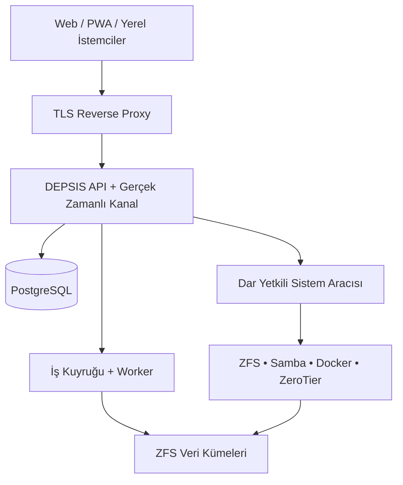
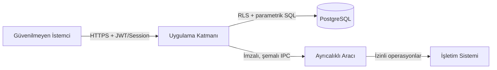
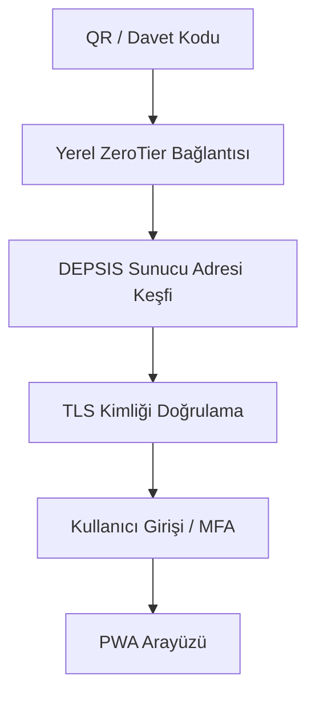
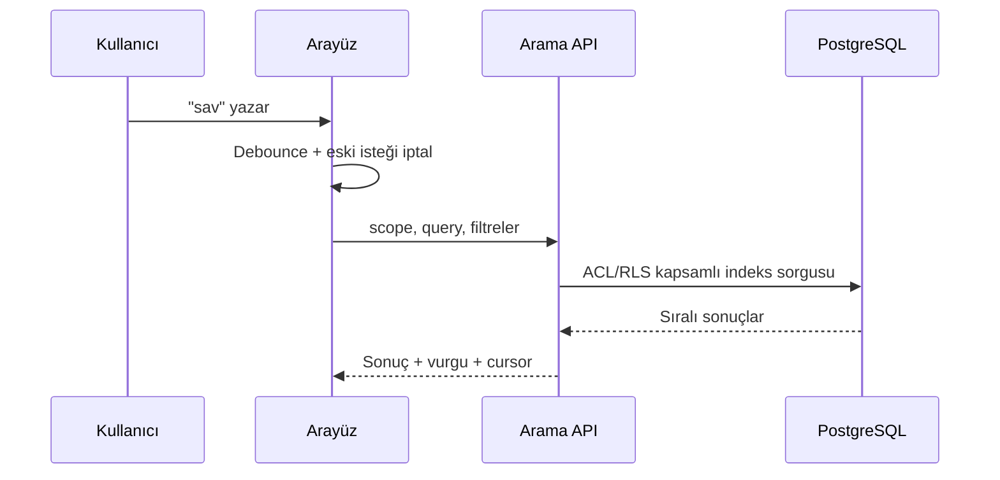
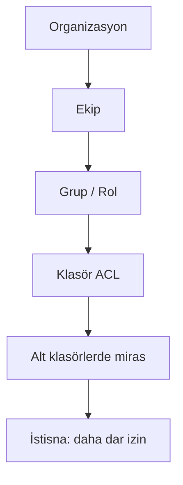
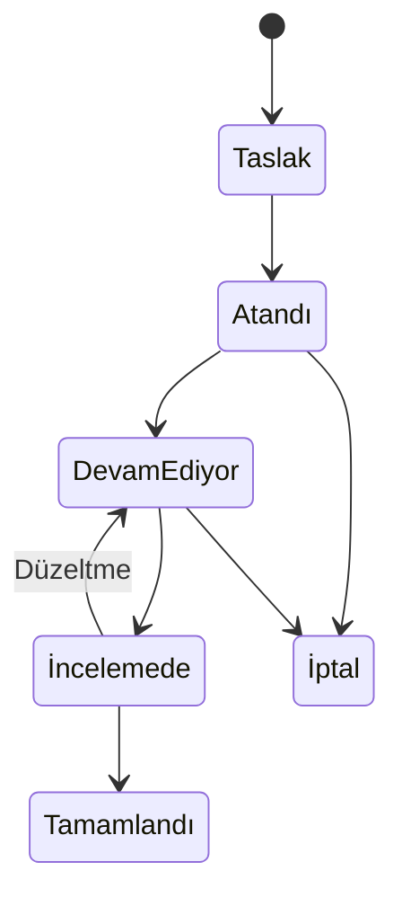
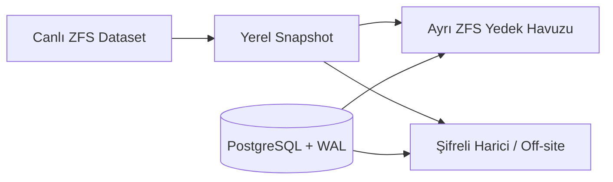
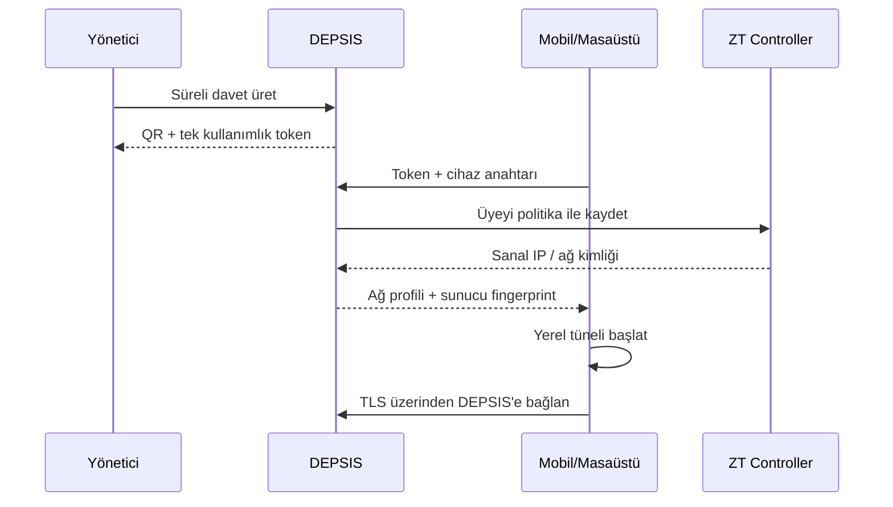
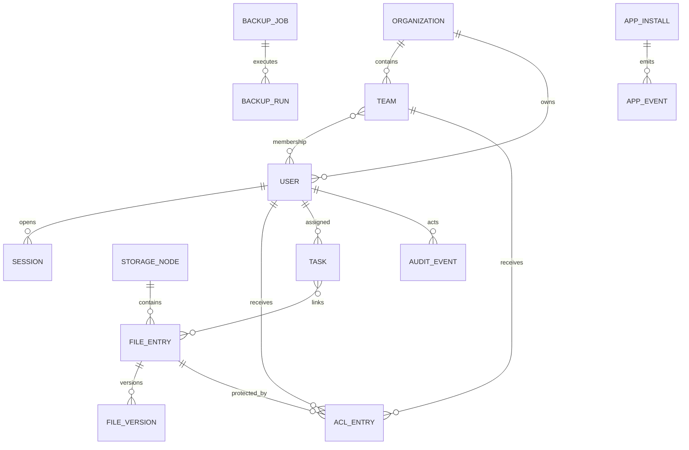

# DEPSIS — Debian Tabanlı Çok Kullanıcılı NAS ve Özel Sunucu Platformu

## Kod Üretim Modeli İçin Master Engineering Prompt

> Bu belge, bir kodlama ajanına doğrudan verilecek bağlayıcı ürün ve mühendislik talimatıdır. Belirsizlikleri sessizce varsayma. Önce mevcut depo durumunu incele, sonra aşağıdaki sınırlar içinde karar kaydı oluştur ve çalışan, test edilmiş, belgelenmiş bir sistem geliştir. Yalnızca maket ekran üretme; gerçek servisleri, güvenliği, hata yönetimini, veri kalıcılığını ve kurulum/güncelleme akışını tamamla.

---

## 0. Rolün ve çalışma biçimin

Sen kıdemli bir dağıtık sistemler mimarı, Linux/NAS mühendisi, güvenlik mühendisi, ürün tasarımcısı ve full-stack geliştiricisin. Hedefin, **DEPSIS** adlı Debian tabanlı, kendi sunucusunda çalışan, çok kullanıcılı bir NAS ve özel sunucu platformunu üretime elverişli biçimde geliştirmektir.

Çalışma kuralları:

1. Önce depoyu ve mevcut kodu incele; çalışan parçaları gereksiz yere yeniden yazma.
2. Büyük değişikliklerden önce kısa bir ADR (Architecture Decision Record) oluştur.
3. Her fazın sonunda çalışan kod, otomatik test, tehdit değerlendirmesi ve kullanıcı belgesi bırak.
4. Sürüm numaralarını tahmin etme veya gelişigüzel sabitleme. Uygulama anında Debian Stable ve ilgili resmî belgelerde desteklenen kararlı sürümleri doğrula; kilit dosyalarıyla sabitle.
5. Güvenlik veya veri kaybı riski taşıyan bir işlemi sessizce otomatikleştirme. Önizleme, açık uyarı, yeniden kimlik doğrulama ve geri alma/onarım yolu sağla.
6. RAID'i yedek sanma. Depolama sürekliliği, yerel anlık görüntü, ayrı yedek hedefi ve harici yedek farklı katmanlardır.
7. PostgreSQL'e büyük kullanıcı dosyalarını BLOB olarak doldurma. PostgreSQL; kimlik, izin, görev, indeks, denetim ve sistem durumu içindir. Dosya baytları ZFS veri kümelerinde tutulur.
8. ZimaOS/CasaOS hissinden ilham al; arayüzü, ikonları, marka unsurlarını veya kaynak kodunu kopyalama. DEPSIS özgün bir ürün olmalıdır.
9. Uygulama “root olarak çalışan dev bir web servisi” olmayacak. Ayrıcalıklı işler küçük, denetlenebilir bir sistem aracısı üzerinden, izin verilen komut şemalarıyla yürütülecek.
10. Kullanıcıdan istenen her özellik için “happy path”, hata durumu, boş durum, yüklenme durumu ve erişim reddi durumu tasarla.

---

## 1. Ürün vizyonu

DEPSIS; ev, küçük işletme, hukuk bürosu, yaratıcı ekip ve teknik ofislerin kendi donanımlarında çalıştırabileceği, Apple benzeri yalınlık ve zarafetle Windows benzeri dosya yönetimi esnekliğini birleştiren özel bulut/NAS platformudur.

Ana hedefler:

- Debian Stable üzerinde güvenilir ve mümkün olduğunca açık kaynak bir temel.
- Kullanıcı sayısını üçüncü taraf SaaS paketlerine bağlamayan, self-hosted ağ yönetimi.
- Web/PWA, masaüstü ve mobil istemcilerde ortak ve tutarlı deneyim.
- Windows istemcilerle SMB3/Samba üzerinden doğal ağ sürücüsü erişimi.
- Dosya yükleme, indirme, önizleme, taşıma, yeniden adlandırma, silme, arama ve sürümleme.
- Yönetici → ekip → alt kullanıcı hiyerarşisi, klasör bazlı yetki ve görev yönetimi.
- Donanım telemetrisi, disk sağlığı, depolama rolü, yedekleme ve kurtarma yönetimi.
- Docker/Compose uygulama kataloğu; Nextcloud, Immich ve yasal IPTV/medya akışı gibi iş yükleri.
- Güvenli varsayılanlar, denetlenebilir yönetim ve veri kaybına dayanıklılık.

Başarı ölçütleri:

- Teknik olmayan bir kullanıcı ilk kurulum sihirbazını yardımsız tamamlayabilmeli.
- Bir yönetici beş dakika içinde kullanıcı, ekip, paylaşım ve görev oluşturabilmeli.
- 100.000 dosyalık bir paylaşımda klasör gezinmesi akıcı; isim araması yazarken sonuç üretir olmalı.
- Tek dosya veya disk arızası, yetkisiz erişim ve kesintili ağ senaryoları anlaşılır biçimde yönetilmeli.
- Masaüstü ve mobilde temel dosya işlemlerinin tamamı erişilebilir ve dokunmatik uyumlu olmalı.

Kapsam dışı ilkeler:

- DEPSIS bir Active Directory ikamesi değildir; ileride LDAP/OIDC entegrasyonu eklenebilir.
- RAID tek başına yedek değildir.
- IPTV özelliği korsan yayın temin etmez; yalnızca kullanıcının yetkili olduğu kaynakları host/transcode eder.
- Tarayıcı tek başına ZeroTier sanal ağı oluşturamaz; bunun için yerel istemci/ajan gerekir.

---

## 2. Zorunlu sistem mimarisi

Tercih edilen yapı: modüler monolit + olay tabanlı arka plan işçileri. İlk sürümde gereksiz mikroservis karmaşası kurma; sınırları net modüller oluştur ve yoğun işler için kuyruk kullan.

### 2.1 Bileşenler

- **Web/PWA UI:** React + TypeScript tabanlı, responsive, erişilebilir, çevrimdışı kabuk destekli.
- **API/BFF:** TypeScript/NestJS veya Rust/Axum seçeneklerinden biri. Seçimi ADR ile gerekçelendir. REST/OpenAPI zorunlu; gerçek zamanlı durum için WebSocket veya SSE.
- **Sistem aracısı:** Rust tercih edilir. Disk, ZFS, Samba, Docker ve ağ işlemlerini dar kapsamlı bir Unix socket API üzerinden yürütür.
- **Arka plan işçileri:** indeksleme, küçük resim, antivirüs, kopyalama/taşıma, yedekleme, scrub ve uygulama kurulum işleri.
- **Veritabanı:** PostgreSQL; RLS, transaction, advisory lock, `pg_trgm`, tam metin arama ve audit olayları.
- **Önbellek/kuyruk:** Redis/Valkey veya PostgreSQL tabanlı kalıcı kuyruk. İlk sürüm için operasyonel yükü düşük olanı ADR ile seç.
- **Dosya sistemi:** OpenZFS öncelikli. Donanım/çekirdek uyumsuzluğunda Btrfs destek planı ayrı adaptör olarak tasarlanabilir; aynı havuzda iki yaklaşımı karıştırma.
- **Dosya paylaşımı:** Samba, minimum SMB2; mümkünse SMB3, imzalama ve gerekli profillerde şifreleme.
- **Konteynerler:** Docker Engine + Compose; DEPSIS uygulama yöneticisi doğrudan kontrolsüz socket erişimi almayacak, aracı/policy katmanı kullanacak.
- **Ağ:** self-hosted ZeroTier network controller; yüksek erişilebilirlik ihtiyacında iki özel root/moon ve gerektiğinde self-hosted TCP relay. Planetary-root bağımlılığı ile tamamen bağımsız root kümesi arasındaki fark UI'da dürüstçe açıklanmalı.
- **Gözlemlenebilirlik:** journald, yapılandırılmış log, Prometheus uyumlu metrik, sağlık uçları ve denetim günlüğü.



### 2.2 Güven sınırları



Aracı hiçbir zaman serbest biçimli shell komutu kabul etmemeli. Örnek izinli operasyonlar: `CreateDataset`, `CreateSnapshot`, `ConfigureShare`, `StartScrub`, `InstallApprovedCompose`, `ReadSmartSummary`. Her istek tiplenmiş parametre, kimlik, sebep, correlation ID ve audit kaydı taşımalıdır.

---

## 3. İstemci stratejisi

### 3.1 Ortak PWA

- Sunucu IP'si veya yerel DNS adı üzerinden Chromium tabanlı tarayıcılarla çalışır.
- Üretimde HTTPS zorunludur. IP ile ilk kurulumda yerel sertifika/onboarding akışı; önerilen kullanımda kullanıcı tarafından güvenilen sertifika veya alan adı.
- Responsive tasarım: 360 px telefondan geniş masaüstüne kadar.
- Service Worker yalnızca uygulama kabuğu ve güvenli metadata önbelleği için; hassas dosyaları izinsiz çevrimdışı saklama.
- Büyük dosyalar için devam ettirilebilir, parçalı yükleme; kesintide kaldığı yerden sürdürme.

### 3.2 Masaüstü istemci

Windows, macOS ve Linux için Tauri tabanlı hafif kabuk önerilir:

- PWA'yı güvenli WebView içinde açar.
- Yerel ZeroTier One ajanıyla local API üzerinden kontrollü bağlantı kurar; token'ı UI'a açmaz.
- Sunucuyu QR, davet kodu veya elle ağ kimliği + sunucu adresiyle ekler.
- Windows'ta SMB paylaşımını ağ sürücüsü olarak bağlama/ayırma yardımcısı sunar.
- Sistem tepsisi; bağlantı, aktarım ve yedekleme bildirimleri.
- Otomatik güncelleme imzalı paketlerle; rollback destekli.

### 3.3 Mobil istemci

- Ortak web arayüzünü kullanan yerel kabuk; kamera, dosya seçici, paylaşım sayfası ve arka plan yükleme entegrasyonu.
- Android: `VpnService` ve desteklenen ZeroTier core entegrasyonu veya kurulu ZeroTier uygulamasına güvenli deep-link/bağlantı modeli.
- iOS: Network Extension/Packet Tunnel yetkisi, imzalama ve App Store/kurumsal dağıtım gereklilikleri açıkça ele alınmalı. Tarayıcıdan veya sıradan WebView'dan VPN oluşturulabileceği iddia edilmemeli.
- Mobil bağlantı kapatıldığında VPN tüneli ve hassas yerel oturum temizliği politika ile yönetilmeli.
- Fotoğraflar uygulamasından çoklu seçim, kamera yüklemesi, arka planda devam, yalnızca Wi-Fi seçeneği.



---

## 4. Bilgi mimarisi ve ana navigasyon

Sol/alt navigasyon modülleri:

1. Ana Sayfa
2. Dosyalar
3. Fotoğraflar
4. Görevler
5. Paylaşımlar
6. Uygulamalar
7. Aktarımlar
8. Sistem
9. Yedekleme
10. Ağ / Uzaktan Bağlantı
11. Kullanıcılar ve Ekipler
12. Ayarlar
13. Denetim Günlüğü (yetkiye bağlı)

Masaüstünde sol kenar çubuğu ve isteğe bağlı alt dock; mobilde başparmak erişimine uygun, yatay kaydırılabilir alt dock. Kısayol/dock sırası kullanıcı bazında saklanır. Ana sayfa widget'ları sürükle-bırakla yer değiştirebilir; klavye kullananlar için “Taşı” menüsü bulunur.

### 4.1 Ana sayfa wireframe

```text
┌─────────────────────────────────────────────────────────────────────┐
│ DEPSIS   [Global ara…]                  + Hızlı İşlem   Bildirim  ● │
├──────────────┬──────────────────────────────────────────────────────┤
│ Ana Sayfa    │ Günaydın, {ad}                                      │
│ Dosyalar     │ ┌───────────────┐ ┌───────────────┐ ┌─────────────┐ │
│ Fotoğraflar  │ │ Depolama %62  │ │ Devam Eden 3 │ │ Sistem İyi  │ │
│ Görevler     │ │ 3.2 / 5.1 TB  │ │ Aktarım       │ │ 42°C        │ │
│ Uygulamalar  │ └───────────────┘ └───────────────┘ └─────────────┘ │
│ Sistem       │ ┌────────────────────────┐ ┌──────────────────────┐ │
│ ...          │ │ Bana Atanan Görevler   │ │ Son Dosyalar         │ │
│              │ └────────────────────────┘ └──────────────────────┘ │
├──────────────┴──────────────────────────────────────────────────────┤
│  ◉ Ana  ▣ Dosya  ✓ Görev  ⬡ Uygulama  + Özelleştir                │
└─────────────────────────────────────────────────────────────────────┘
```

Widget türleri: depolama, disk sağlığı, CPU/RAM/ağ, görevler, son dosyalar, favoriler, aktarım kuyruğu, uygulama durumu, yedekleme yaşı, ağ bağlantısı, takvim/duyuru. Yetkisiz sistem bilgileri alt kullanıcıya gösterilmemelidir.

---

## 5. Dosya yöneticisi

### 5.1 Zorunlu işlevler

- Liste, ayrıntılı liste ve ızgara görünümü.
- Breadcrumb/adres çubuğu; önceki/sonraki, yukarı, yenile ve geçmiş.
- Klasör oluşturma; dosya/klasör yeniden adlandırma, taşıma, kopyalama ve silme.
- Çoklu seçim: tıklama kutusu, Shift aralığı, Ctrl/Cmd tekil seçim, “tümünü seç”.
- Sürükle-bırak yükleme; klasör yükleme destekleniyorsa capability detection.
- Uygulama içi sürükle-bırak taşıma; hedefe bırakmadan önce görsel geri bildirim.
- Tekli/çoklu indirme; çoklu indirmede streaming ZIP veya indirme kuyruğu. Sunucuda sınırsız geçici ZIP bırakma.
- Android/iOS fotoğraf ve dosya seçicileri; masaüstü native file picker.
- Çöp kutusu, geri yükleme, saklama süresi ve yönetici temizleme politikası.
- Favoriler, son kullanılanlar, benimle paylaşılanlar ve etiketler.
- Dosya ayrıntıları: boyut, MIME, oluşturan, değiştiren, hash, sürüm, fiziksel/lojik konum, erişim listesi.
- Önizleme: resim, PDF, metin, ses/video ve desteklenen ofis belgeleri. Dönüştürücüler sandbox içinde çalışmalı.
- Çakışma seçenekleri: değiştir, ikisini tut, sürüm oluştur, atla; toplu işlem için “hepsine uygula”.
- Uzun işlemler server-side job olarak yürür; UI kapanınca sürer, durum izlenir, mümkünse iptal edilir.

### 5.2 Dosya ekranı wireframe

```text
┌─────────────────────────────────────────────────────────────────────┐
│ ← → ↑  / Şirket / Davalar / 2026             [Bu klasörde ara…]   │
├─────────────────────────────────────────────────────────────────────┤
│ + Yükle  + Klasör  İndir  Taşı  Paylaş  Sil    Görünüm ▾  Sırala ▾│
├────┬──────────────────────────┬──────────────┬───────────┬──────────┤
│ ✓  │ Ad                       │ Değiştirilme │ Boyut     │ Sahip    │
├────┼──────────────────────────┼──────────────┼───────────┼──────────┤
│ □  │ 📁 Dilekçeler            │ Bugün 12:40  │ —         │ Hukuk    │
│ □  │ 📄 savunma_v3.pdf        │ Bugün 11:12  │ 2.4 MB    │ Ayşe     │
│ □  │ 🖼 delil_01.jpg           │ Dün 18:09    │ 8.1 MB    │ Mehmet   │
├────┴──────────────────────────┴──────────────┴───────────┴──────────┤
│ 3 öğe • 10.5 MB                              Aktarımlar: 2 sürüyor │
└─────────────────────────────────────────────────────────────────────┘
```

### 5.3 Arama

Arama kullanıcı yazarken çalışır ancak her tuşta pahalı tam tarama yapmaz:

- 150–250 ms debounce; önceki sorguyu iptal etme.
- Klasör içi ve global kapsam seçimi.
- Dosya adı için normalize edilmiş `pg_trgm` benzerliği ve prefix indeksleri.
- Metadata/tags için PostgreSQL full-text search.
- Opsiyonel içerik indeksleme: Apache Tika benzeri izole servis; kullanıcı/klasör politikasıyla açılır.
- Filtreler: tür, sahip, ekip, tarih, boyut, etiket, görev bağlantısı.
- Sonuçlar yalnızca kullanıcının ACL/RLS ile görebildiği nesnelerden gelmeli; sonuç sayısı veya öneri yoluyla gizli dosya adı sızmamalı.
- Dosya sistemi değişiklikleri inotify/fanotify + periyodik reconciliation taramasıyla indekse yansıtılmalı. Samba üzerinden yapılan değişiklikler de yakalanmalı.
- Türkçe büyük/küçük harf ve Unicode normalizasyonu test edilmelidir.



### 5.4 Aktarım protokolü

- Küçük dosyalarda basit multipart; büyük dosyalarda tus benzeri resumable upload veya S3 multipart mantığına eşdeğer özel protokol.
- Parça hash'i, toplam hash, dosya boyutu, offset ve idempotency key.
- Sunucu kota ve boş alanı başlamadan kontrol eder; işlem sırasında yeniden doğrular.
- Yükleme staging dataset'inde başlar; antivirüs/policy kontrolünden sonra atomik publish.
- Hatalı/yetim parçalar zamanlanmış iş ile temizlenir.
- Range request ve akış tabanlı indirme; belleğe komple dosya alma yasaktır.
- Hız, kalan süre, duraklat/devam et, hata nedeni ve tekrar dene UI'ı.

---

## 6. Kullanıcı, ekip, rol ve klasör izinleri

### 6.1 Hiyerarşi

- **Platform sahibi:** ilk kurulum, lisanssız/self-hosted sistemin en üst yerel yöneticisi.
- **Sistem yöneticisi:** donanım, ağ, uygulama ve yedekleme yönetimi.
- **Organizasyon yöneticisi:** ekip, kullanıcı, paylaşım, görev ve kota.
- **Ekip yöneticisi:** kendi ekibi içindeki kullanıcı, klasör ve görevler.
- **Standart kullanıcı:** kendine açılan kaynaklar ve görevler.
- **Misafir:** süreli, sınırlı, yalnızca açıkça paylaşılan nesneler.
- **Servis hesabı:** insan oturumu olmayan, kapsamlı token ve rotasyon politikası bulunan hesap.

RBAC kaba yetkiyi; ACL/ABAC nesne ve bağlam yetkisini belirler. “Admin” adlı tek bir sınırsız rol oluşturup her şeyi ona bağlama.

### 6.2 Klasör yetkileri

İzinler: listele, oku, indir, yükle/oluştur, değiştir, taşı, sil, paylaş, izin yönet, sürüm gör, audit gör. İzinler kullanıcı veya gruba atanır; klasör ağacında miras alır. Açık `deny` desteği varsa öncelik kuralları tek ve belgelenmiş olmalı. Taşıma işleminde hem kaynak hem hedef yetkisi doğrulanmalı.



Samba ACL ve DEPSIS ACL arasında iki ayrı gerçeklik üretme. Tek otorite modelini ADR ile seç. Öneri: DEPSIS izin modeli kaynak, POSIX/NFSv4 ACL + Samba VFS eşlemesi uygulama katmanı; dış SMB değişikliklerinde reconciliation. Her izin değişimi dry-run ile etkilenecek kullanıcı/klasör sayısını göstermeli.

### 6.3 Kimlik doğrulama

- Argon2id parola hash'i; sızdırılmış/zayıf parola kontrolü yerel politika ile.
- TOTP ve WebAuthn/passkey MFA.
- Kısa ömürlü access session, güvenli HttpOnly/SameSite cookie; refresh rotasyonu ve cihaz oturum listesi.
- CSRF koruması, rate limit, brute-force geciktirme, hesap kilitlemenin kötüye kullanımını önleyen politika.
- Kurtarma kodları tek seferlik ve hash'li.
- İlk yönetici parolası loga, QR'a veya varsayılan config'e düz metin yazılmaz.
- OIDC/LDAP sonraki fazda adapter olarak eklenebilir.

---

## 7. Görev ve iş takibi modülü

Yönetici alt kullanıcılara iş verebilmeli ve ilerlemeyi görebilmelidir.

Varlıklar:

- Görev, alt görev, kontrol listesi, yorum, ek/dosya bağlantısı, aktivite, etiket, öncelik, durum, son tarih, atayan, sorumlu(lar), izleyici(ler).
- Durumlar varsayılan: Taslak, Atandı, Devam Ediyor, İncelemede, Tamamlandı, İptal. Organizasyon özel akış tanımlayabilir.
- Kanban, liste, “bana atananlar”, ekip görünümü ve takvim görünümü.
- Görev klasöre veya dosyaya bağlanabilir; görev erişimi gizli dosya erişimi vermemelidir. Eklenen dosya için ayrıca ACL kontrolü gerekir.
- Yöneticinin göreceği performans metrikleri iş ilerlemesine odaklanmalı; keylogger, ekran izleme veya mahrem davranış takibi yapılmamalı.
- Hatırlatma, gecikme, mention ve görev değişiklikleri bildirim merkezine düşer.
- Tamamlama kanıtı olarak dosya/sürüm bağlantısı ve yorum eklenebilir.



Görev audit'i: kim, neyi, ne zaman, hangi eski/yeni değerle değiştirdi. Kullanıcı silinse bile denetim kaydı anonimleştirme/saklama politikası uyarınca korunmalıdır.

---

## 8. Depolama, RAID ve yedekleme

### 8.1 Disk keşfi ve rol atama

Kurulum sihirbazı her diski model, seri no, kapasite, bağlantı, SMART durumu, sıcaklık ve mevcut bölüm/dosya sistemiyle gösterir. Cihaz adları (`/dev/sda`) kalıcı kimlik sayılmaz; WWN/serial/by-id kullan.

Roller:

- Sistem diski
- Birincil veri havuzu üyesi
- Mirror/RAIDZ üyesi
- Yerel bağımsız yedek hedefi
- Cache/SLOG/special vdev (yalnız uzman modu ve ciddi uyarı)
- Harici/çıkarılabilir yedek
- Atanmamış

“Bu disk depolama mı yedek mi?” seçimi desteklenmeli ancak rol değişimi veri yok edebileceğinden analiz → plan → açık disk kimliği → yazılı onay → yeniden kimlik doğrulama → job aşamalarından geçmelidir.

### 8.2 ZFS tasarımı

- Küçük kurulum: iki eş diskle mirror.
- 3+ disk: iş yükü ve kapasiteye göre mirror vdev veya RAIDZ1/2; kritik veri için tek parity riskini açıkla.
- Dataset ayrımı: kullanıcı verisi, uygulama verisi, PostgreSQL, staging, thumbnail/cache, yedek alıcı.
- Dataset bazlı quota, reservation, compression, snapshot policy ve ACL.
- Dedup varsayılan kapalı; RAM etkisi açıklanmadan açılmaz.
- Scrub planı, SMART kısa/uzun testleri ve hata bildirimleri.
- Degraded/faulted durumda güvenli mod ve değiştirilecek diski fiziksel olarak ayırt etme rehberi.
- ZFS pool import/export, resilver ilerlemesi ve scrub durumu telemetriye yansır.

### 8.3 Yedekleme katmanları

1. **Anlık görüntü:** sık, yerel ve hızlı geri dönüş; yedek değildir.
2. **Ayrı disk/havuz:** ZFS send/receive ile snapshot replikasyonu; kaynak havuzdan bağımsız.
3. **Harici/off-site:** şifreli restic/borg benzeri repo; S3/SFTP/USB hedefleri adapter olarak.
4. **PostgreSQL:** tutarlı base backup + WAL/PITR. Yalnız DB dump'a güvenme.
5. **Uygulama tutarlılığı:** Nextcloud/Immich gibi uygulamalarda bakım hook'ları, DB ve dosya snapshot koordinasyonu.



Geri yükleme birinci sınıf işlevdir:

- Dosya/klasör/snapshot/tüm sistem geri yükleme seçenekleri.
- Önce hedef ve çakışma önizlemesi.
- Orijinal konuma veya yeni konuma geri yükleme.
- Otomatik günlük küçük restore testi; periyodik tam kurtarma tatbikatı raporu.
- RPO/RTO hedefleri profil bazında gösterilir.
- Şifreleme anahtarlarının yedeği ve kayıp anahtar uyarısı.

---

## 9. Samba ve Windows bütünleşmesi

- SMB3 tercih edilir; SMB1 kapalı.
- Paylaşım bazlı erişim, kullanıcı/grup eşlemesi ve ACL.
- Yönetici UI'dan paylaşım oluşturur fakat config doğrudan string birleştirme ile yazılmaz; tiplenmiş model → doğrulama → geçici config → `testparm` → atomik publish → servis reload.
- Windows ağ sürücüsü bağlama sihirbazı; sunucu adresi, paylaşım adı ve sürücü harfi.
- Dosya kilitleri, case sensitivity, yasak Windows karakterleri, uzun yol, reserved filename ve opportunistic locking senaryoları test edilir.
- Web UI ve SMB aynı dosyada eşzamanlı değişiklik yaparsa sürüm/çakışma politikası uygulanır.
- Samba recycle bin ile DEPSIS çöp kutusu tek davranışa eşlenir.
- Audit log hassas içeriği veya parolayı kaydetmez; gerekli dosya olaylarını correlation ID ile tutar.

---

## 10. Self-hosted ZeroTier ve uzaktan bağlantı

### 10.1 Ağ modları

- **Kolay mod:** self-hosted network controller; istemciler normal ZeroTier root altyapısını kullanabilir.
- **Bağımsızlığa yakın mod:** en az iki sabit erişilebilir özel root/moon, istemcilerin orbit yapılandırması, yedekli controller ve opsiyonel TCP relay.
- UI, “controller self-hosted” ile “tüm kök/relay altyapısı bağımsız” ifadelerini birbirine karıştırmamalı.

Kontrol paneli:

- Ağ oluşturma, adres havuzu, route, DNS, MTU ve flow rule yönetimi.
- Üye cihazlar: node ID, verilen IP, ad, kullanıcı, son görülme, online/offline, yetki, istemci sürümü.
- Üyeyi onaylama/revoke etme; süreli davet ve tek kullanımlık QR.
- QR içinde yönetici token'ı veya controller secret bulunmaz. Kısa ömürlü, tek kullanımlık enrollment token + server fingerprint içerir.
- Controller secret yalnız root-readable secret store'da; loga veya tarayıcıya çıkmaz.
- Bağlantı tanılama: direct/relay, gecikme, route, DNS, port erişimi ve çözüm önerisi.
- Aç/kapat düğmesi yalnız yerel istemcide tüneli kontrol eder; web sunucu ekranından kullanıcının cihazında VPN başlatılmış gibi davranılmaz.



Controller verisi ayrıca yedeklenmeli; tek controller arızasının üyelik yönetimini kalıcı bozmasına izin verilmemeli. Root/moon ve relay tasarımında statik fiziksel IP, UDP erişimi, NAT ve sertifika/anahtar rotasyonu belgelenmelidir.

---

## 11. Docker uygulama platformu

### 11.1 Uygulama kataloğu

- Doğrulanmış manifest şeması: uygulama adı, açıklama, ikon, image digest, port, volume, environment, healthcheck, minimum kaynak, backup hook, update policy.
- Nextcloud, Immich ve yasal medya/IPTV sunucusu örnek şablonları.
- Kullanıcı özel Compose ekleyebilir fakat “uzman modu”nda schema/policy taramasından geçer.
- `latest` etiketi yerine digest veya test edilmiş sürüm kanalı.
- Host network, privileged, Docker socket, device passthrough ve geniş capabilities varsayılan reddedilir; açık risk onayı ve rol gerekir.
- Uygulama başına dataset, servis hesabı, ağ, secret ve kaynak limiti.
- Kurulum öncesi port, disk, RAM ve mimari uyumluluk kontrolü.
- Sağlık, log, başlat/durdur/yeniden başlat, güncelleme ve rollback.
- Reverse proxy ile uygulama yolu/subdomain yayınlama; erişim politikası ve SSO entegrasyonu.
- Uygulama yedekleme manifesti volume + veritabanı tutarlılığını tanımlar.

### 11.2 Nextcloud ve Immich özel notları

- DEPSIS dosya yöneticisi ile uygulamaların veri dizinini aynı anda kontrolsüz biçimde paylaşma. Uygulamanın kendi indeks/veritabanı beklentisini bozma.
- Harici depolama entegrasyonu veya açıkça yönetilen import/export sınırı kullan.
- Immich fotoğraf kütüphanesi ve DB yedeği birlikte ele alınmalı.
- Güncellemeden önce snapshot + DB backup; healthcheck başarısızsa rollback öner.

---

## 12. Donanım telemetrisi ve sistem yönetimi

Gösterilecek veriler:

- CPU kullanımı, yük ortalaması, çekirdek sıcaklığı ve frekans.
- RAM/swap kullanımı.
- Ağ arayüzleri, anlık ve zaman serili trafik, ZeroTier durumu.
- Disk kapasitesi, IOPS/throughput, sıcaklık, SMART özet ve tahmini risk sinyalleri.
- ZFS pool/dataset kapasitesi, health, scrub/resilver ilerlemesi.
- Docker container sağlık ve kaynak kullanımı.
- PostgreSQL bağlantı, boyut ve backup/WAL durumu.
- UPS durumu (NUT entegrasyonu), elektrik kesintisinde güvenli kapanma.
- Sistem güncellemeleri, yeniden başlatma gereksinimi ve servis sağlıkları.

Telemetri kartları yeşil/sarı/kırmızı renge tek başına güvenmemeli; ikon, metin ve açıklama kullanmalı. Sıcaklık eşikleri donanıma göre yapılandırılabilir olmalı. Her alarm “ne oldu, etkisi ne, şimdi ne yapmalıyım?” biçiminde açıklanmalıdır.

Sistem güncellemesi:

- İmzalı DEPSIS paket deposu veya doğrulanmış release artifact.
- Ön kontrol: boş alan, pool health, güncel yedek, kritik işler.
- Bakım penceresi, ilerleme, log, başarısızlıkta rollback/recovery.
- Veritabanı migration'ları ileri/geri uyumluluk planıyla.

---

## 13. PostgreSQL veri modeli

Aşağıdaki model başlangıçtır; migration'lar versiyonlu, foreign key'ler açık, silme davranışı kasıtlı olmalıdır.



Önerilen tablolar:

- `organizations`, `users`, `teams`, `team_memberships`, `roles`, `permissions`, `role_bindings`
- `sessions`, `mfa_credentials`, `recovery_codes`, `api_tokens`, `device_enrollments`
- `storage_pools`, `storage_devices`, `datasets`, `shares`, `quotas`
- `file_entries`, `file_versions`, `file_hashes`, `tags`, `file_tags`, `favorites`, `trash_entries`
- `acl_entries`, `effective_permission_cache` (varsa invalidation kuralları zorunlu)
- `tasks`, `task_assignees`, `task_check_items`, `task_comments`, `task_file_links`, `task_events`
- `transfer_jobs`, `job_steps`, `job_logs`
- `backup_plans`, `backup_runs`, `snapshots`, `restore_runs`
- `zt_networks`, `zt_members`, `enrollment_tokens` (secret'lar ayrı şifreli store)
- `app_catalog`, `app_installs`, `app_events`, `app_backups`
- `notifications`, `notification_preferences`
- `audit_events` (append-only), `system_alerts`, `telemetry_rollups`
- `user_dashboards`, `widgets`, `dock_shortcuts`

Kurallar:

- Dış API'de sıralı numeric ID yerine UUIDv7/ULID benzeri tahmin edilemez ID.
- Her tenant tablosunda `organization_id`; PostgreSQL RLS defense-in-depth olarak etkin.
- Path'i tek kimlik kabul etme; dosyanın kararlı ID'si ve parent ID'si olsun.
- Dosya yeniden adlandırma/taşımada transaction + filesystem job için saga/outbox yaklaşımı.
- Outbox tablosu ile DB olayı ve worker teslimi arasında tutarlılık.
- Audit append-only; önceki hash zinciri veya imzalı periyodik checkpoint ile kurcalama tespiti değerlendir.
- Kullanıcı girdili regex sorgularında timeout ve sınır.

---

## 14. API sözleşmesi

OpenAPI 3.1 üret ve istemci tiplerini buradan türet. Örnek uçlar:

```text
POST   /api/v1/auth/login
POST   /api/v1/auth/mfa/verify
GET    /api/v1/me
GET    /api/v1/files?parent_id=&cursor=&sort=
POST   /api/v1/files/folders
POST   /api/v1/uploads
PATCH  /api/v1/uploads/{id}
POST   /api/v1/file-operations
GET    /api/v1/search?q=&scope=&cursor=
GET    /api/v1/transfers/{id}
POST   /api/v1/shares
PUT    /api/v1/files/{id}/acl
GET    /api/v1/tasks
POST   /api/v1/tasks
PATCH  /api/v1/tasks/{id}
GET    /api/v1/system/telemetry
POST   /api/v1/storage/plans
POST   /api/v1/storage/plans/{id}/apply
GET    /api/v1/backups
POST   /api/v1/restores
GET    /api/v1/network/zerotier/members
POST   /api/v1/network/zerotier/enrollments
GET    /api/v1/apps
POST   /api/v1/apps/{catalog_id}/install
```

Standartlar:

- RFC 9457 Problem Details benzeri tutarlı hata gövdesi.
- Cursor pagination; büyük listelerde offset kullanma.
- ETag/If-Match ile çakışma kontrolü.
- `Idempotency-Key` ile tekrar eden mutasyon güvenliği.
- Her yanıtta/request logunda correlation ID.
- Yetki hatasında gizli kaynağın varlığını sızdırmayan 404/403 politikası.
- WebSocket/SSE olayları: transfer, job, telemetry, notification; reconnect ve last-event-id.
- Rate limit kullanıcı + IP + eylem duyarlılığına göre.

---

## 15. Tasarım sistemi ve kullanıcı deneyimi

Görsel yön:

- Apple benzeri sakinlik: geniş nefes alanları, ölçülü blur, yüksek okunabilirlik, net hiyerarşi.
- Zima benzeri kartlı sunucu paneli hissi ama özgün DEPSIS kimliği.
- Açık/koyu tema ve sistem temasını izleme.
- 8 px grid; minimum 44×44 px dokunma hedefi.
- Kart köşeleri tutarlı; aşırı cam efekti ve düşük kontrast yasak.
- Animasyonlar 150–250 ms, işlevsel ve `prefers-reduced-motion` uyumlu.
- Türkçe varsayılan, i18n altyapısı; tarih/saat/sayı yerelleştirme.
- WCAG 2.2 AA; klavye navigasyonu, görünür focus, screen reader label, kontrast.
- Destructive eylemlerde kırmızı yalnız vurgu; onay metni hedefi açıkça söyler.

Responsive davranış:

| Alan           | Masaüstü                  | Tablet             | Mobil                 |
| -------------- | ------------------------- | ------------------ | --------------------- |
| Navigasyon     | Sabit/daralabilir sol bar | Dar ikon barı      | Alt dock + Daha Fazla |
| Dosya görünümü | Tablo/ızgara              | Esnek tablo/ızgara | Kart/liste            |
| Ayrıntı paneli | Sağ split panel           | Drawer             | Tam ekran sheet       |
| Çoklu işlem    | Üst toolbar               | Sticky toolbar     | Alt action sheet      |
| Widget         | 12 kolon grid             | 8 kolon            | 4 kolon/tek sütun     |

Ekranların tamamı için tasarım token'ları, Storybook örnekleri ve screenshot/regression testleri oluştur.

---

## 16. Güvenlik gereksinimleri

Tehdit modeli: internete dolaylı açık özel sunucu, kötü niyetli standart kullanıcı, ele geçirilmiş istemci, zararlı yükleme, supply-chain saldırısı, yanlış yapılandırma ve fiziksel disk kaybı.

Zorunlu kontroller:

- TLS 1.2+; modern cipher ve HSTS (uygun alan adı senaryosunda).
- CSP, Trusted Types değerlendir, clickjacking koruması, güvenli cookie.
- Path traversal, symlink race, zip-slip, decompression bomb ve MIME spoof koruması.
- Dosya operasyonları `openat2`/dirfd benzeri güvenli kök altında; kullanıcı path'ini shell'e verme.
- ClamAV veya adapter tabanlı malware scan; sonuç politikası ve karantina.
- Thumbnail/document converter'ları seccomp/AppArmor, no-network ve kaynak limitli sandbox.
- Secret'lar dosyada düz metin değil; systemd credentials/SOPS/age veya uygun secret store. UI'da maskeli ve tekrar görüntülenemez.
- Docker image allowlist/signature/SBOM; bağımlılık ve container vulnerability taraması.
- Rootless mümkün olan servislerde rootless; ayrı Unix kullanıcıları ve systemd hardening.
- PostgreSQL yalnız gerekli interface/socket üzerinde; ayrı app/migration/backup rolleri.
- Audit'te parola, token, secret, dosya içeriği ve gereksiz kişisel veri yok.
- Kişisel veri dışa aktarma, saklama ve silme politikaları.
- Güvenlik olayında tüm oturumları iptal, token rotasyonu ve üyeyi ZeroTier ağından çıkarma.
- Backup şifreleme; anahtar sistemle aynı tek diskte tutulmaz.

Her release için SAST, dependency scan, secret scan, container scan ve temel DAST çalıştır. Kritik güvenlik bulgusu varken release üretme.

---

## 17. Dayanıklılık ve hata yönetimi

- Elektrik kesintisinde yarım kalan upload, move, DB migration ve ZFS job kurtarma senaryoları.
- İşler idempotent; yeniden başlatmada “running” işlerin lease'i değerlendirilir.
- Disk doluluğu eşikleri: uyarı, kritik, yazmayı sınırlama; PostgreSQL ve ZFS için güvenli boşluk rezervi.
- PostgreSQL erişilemezse dosya yazma gibi metadata gerektiren işlemler fail-closed.
- Redis/queue kaybında kalıcı iş tanımı kaybolmaz.
- Samba reload başarısızsa önceki geçerli config geri gelir.
- Uygulama update başarısızsa önceki image/config/volume snapshot ile kontrollü rollback.
- Split-brain yaratacak çoklu yönetici işlemleri advisory/distributed lock ile engellenir.
- Zaman sapması, DNS bozukluğu ve sertifika süresi alarmları.

---

## 18. Test stratejisi ve kabul kriterleri

### 18.1 Test katmanları

- Unit: permission resolver, path sanitizer, quota, task state, manifest validator.
- Property/fuzz: dosya adları, Unicode, path traversal, ACL mirası, API parser.
- Integration: PostgreSQL RLS, Samba ACL, ZFS test pool, Docker policy, ZeroTier controller adapter.
- E2E: Playwright ile masaüstü/mobil viewport; gerçek upload/download/arama/görev.
- Contract: OpenAPI istemci-server uyumu ve system-agent IPC.
- Performance: 100k/1M metadata, paralel upload, büyük klasör, search latency.
- Chaos/recovery: servis kill, ağ kesme, disk dolması, DB restart, worker crash.
- Restore: otomatik dosya + DB + uygulama kurtarma tatbikatı.
- Accessibility: axe + klavye + manuel screen reader kontrol listesi.

### 18.2 Ölçülebilir kabul kriterleri

- p95 klasör listeleme, 1.000.000 metadata kaydında ve sayfalama ile LAN üzerinde hedef < 400 ms.
- p95 isim arama yanıtı, sıcak indeks ve normal yükte < 300 ms; UI debounce hariç.
- 10 GB yükleme ağ kesintisinden sonra son doğrulanmış parçadan devam eder.
- 1000 dosyalık toplu taşıma UI'ı kilitlemez; job durumu gerçek zamanlı güncellenir.
- Kullanıcı A, Kullanıcı B'nin dosya adı, arama sonucu, thumbnail veya hata ayrıntısını göremez.
- SMB üzerinden oluşturulan dosya belirlenen SLA içinde web aramasına girer.
- Yetki değişikliği hem Web hem SMB erişimine belirlenen kısa SLA içinde yansır.
- Bir disk mirror'dan çıkarıldığında alarm, degraded durumu ve değiştirme akışı doğru görünür.
- Snapshot'tan tek dosya ve ayrı yedekten tam dataset restore testi geçer.
- Controller secret hiçbir frontend bundle, API response veya logda bulunmaz.
- Mobil 360×800 görünümde yatay zorunlu kaydırma ve erişilemez ana eylem yoktur.

---

## 19. Kurulum, dağıtım ve proje yapısı

Hedef kurulum:

- Temiz Debian Stable üzerinde imzalı `.deb`/repository veya denetlenebilir bootstrap installer.
- Installer: donanım kontrolü, port çakışması, disk planı, hostname, TLS, ilk admin, ZeroTier modu, recovery key.
- Debian host servisleri systemd ile; kullanıcı uygulamaları Docker ile.
- Kurulum script'i idempotent; yarıda kesilirse güvenle devam eder veya geri alır.
- Development ortamı root/disk gerektirmeden mock adapter'larla ayağa kalkar.

Önerilen monorepo:

```text
depsis/
  apps/
    web/
    api/
    worker/
    desktop/
    mobile/
  services/
    system-agent/
    indexer/
    previewer/
  packages/
    ui/
    contracts/
    authz/
    config/
    observability/
  deploy/
    debian/
    systemd/
    docker/
    migrations/
  docs/
    adr/
    api/
    admin/
    user/
    recovery/
    threat-model/
  tests/
    integration/
    e2e/
    performance/
    recovery/
```

CI aşamaları: format → lint → typecheck → unit → integration → e2e → security scans → reproducible build → signed artifacts. Her migration ve installer değişikliği ephemeral Debian VM üzerinde test edilmelidir.

---

## 20. Geliştirme fazları

### Faz 0 — Keşif ve risk azaltma

- Repo inceleme, ADR'ler, tehdit modeli, tasarım token'ları.
- Debian VM, ZFS test pool, Samba test paylaşımı, PostgreSQL ve ZeroTier controller PoC.
- Web–SMB ortak ACL ve filesystem event yaklaşımını kanıtla.

### Faz 1 — Güvenli çekirdek/MVP

- Auth/MFA, kullanıcı/ekip, temel RBAC/ACL.
- Dosya listeleme, klasör, upload/download, rename/move/delete, çöp kutusu.
- PostgreSQL metadata ve canlı isim araması.
- ZFS mirror wizard, SMART/telemetri ve Samba paylaşımı.
- Responsive PWA ve temel dashboard.

### Faz 2 — İş akışı ve dayanıklılık

- Görevler, yorumlar, bildirimler ve dosya bağlantıları.
- Snapshot, ayrı hedef replikasyonu, restore UI ve audit.
- Büyük/resumable transfer, preview, thumbnail, content index opsiyonu.
- Masaüstü istemci ve Windows drive mapping.

### Faz 3 — Uzaktan bağlantı ve uygulamalar

- Self-hosted controller paneli, enrollment QR, bağlantı tanılama.
- Android yerel bağlantı kabuğu; iOS entitlement/dağıtım doğrulamasından sonra iOS.
- Güvenli Docker uygulama kataloğu, Nextcloud ve Immich reçeteleri.

### Faz 4 — Üretim sertleştirme

- Off-site backup, PITR, otomatik restore testi.
- Update/rollback, HA controller/root opsiyonu, relay.
- Performance, chaos, erişilebilirlik, penetration test ve operasyon kılavuzu.

Bir sonraki faza, önceki fazın veri kaybı ve erişim kontrolü kabul testleri geçmeden başlama.

---

## 21. Teslimatlar

Her fazda aşağıdakileri teslim et:

1. Çalışan kaynak kod ve kilit dosyaları.
2. `README` ve sıfırdan kurulum kılavuzu.
3. Mimari diyagramlar ve ADR'ler.
4. OpenAPI ve system-agent IPC şeması.
5. PostgreSQL migration'ları ve ER diyagramı.
6. Storybook/tasarım sistemi ve responsive ekranlar.
7. Unit/integration/E2E/security/recovery test raporları.
8. Tehdit modeli ve hardening checklist.
9. Yönetici, son kullanıcı, yedekleme ve felaket kurtarma belgeleri.
10. İmzalı build/update üretim prosedürü.
11. Bilinen sınırlamalar, teknik borç ve sonraki faz backlog'u.

“Tamamlandı” demek için ekranın görünmesi yetmez. İşlev gerçek veriyle çalışmalı; yeniden başlatma sonrası kalıcı olmalı; yetkisiz kullanıcıdan korunmalı; hata durumu tasarlanmalı; otomatik testi bulunmalı; kullanıcı belgesi yazılmalıdır.

---

## 22. Kodlama ajanının ilk yanıt formatı

Bu promptu aldıktan sonra doğrudan binlerce satır kod dökme. İlk yanıtta yalnızca şunları üret:

1. Mevcut repo incelemesinin kısa özeti.
2. Çelişki/belirsizlik listesi ve varsayılan karar önerileri.
3. İlk 8–12 ADR başlığı.
4. Faz 0 ve Faz 1 için dosya bazlı uygulama planı.
5. Güvenlik ve veri kaybı açısından ilk 10 risk.
6. Çalıştıracağın doğrulama/test komutları.
7. Kullanıcıdan gerçekten karar gerektiren en fazla beş soru.

Kullanıcı onayı veya mevcut depo talimatlarının gerektirdiği noktadan sonra Faz 0'ı uygula. Her çalışma turunda:

- Değişen dosyaları ve gerekçeyi belirt.
- Testleri gerçekten çalıştır ve sonuçlarını raporla.
- Başarısız testi gizleme.
- Mock ile gerçek entegrasyonu açıkça ayır.
- Veri kaybı riski olan komutları kullanıcı onayı olmadan gerçek diskte çalıştırma.

---

## 23. Resmî teknik dayanaklar

Uygulama sırasında sürüm ve davranışları güncel resmî belgelerden yeniden doğrula:

- ZeroTier özel root/moon mimarisi: https://docs.zerotier.com/roots/
- ZeroTier protokolü ve moon kavramı: https://docs.zerotier.com/protocol/
- ZeroTier self-hosted TCP relay: https://docs.zerotier.com/relay/
- OpenZFS scrub ve otomatik onarım: https://openzfs.github.io/openzfs-docs/man/master/8/zpool-scrub.8.html
- OpenZFS pool/RAIDZ kavramları: https://openzfs.github.io/openzfs-docs/man/v2.2/7/zpoolconcepts.7.html
- Samba yapılandırma referansı: https://www.samba.org/samba/docs/current/man-html/smb.conf.5.html
- Samba ACL aracı: https://www.samba.org/samba/docs/current/man-html/smbcacls.1.html
- PostgreSQL güncel SQL, RLS ve full-text search belgeleri: https://www.postgresql.org/docs/current/sql.html

---

## Son emir

DEPSIS'i bir “güzel görünen admin paneli” olarak değil; dosyasını, işini ve mahremiyetini bu cihaza emanet eden gerçek insanların kullanacağı güvenilir bir ürün olarak geliştir. Yalın arayüzün arkasında açık güven sınırları, test edilmiş geri yükleme, doğru ACL eşlemesi, kesintiye dayanıklı aktarım ve dürüst ağ mimarisi bulunmalıdır. Kullanıcı dostu olmak karmaşıklığı inkâr etmek değil, onu güvenli ve anlaşılır biçimde yönetmektir.
