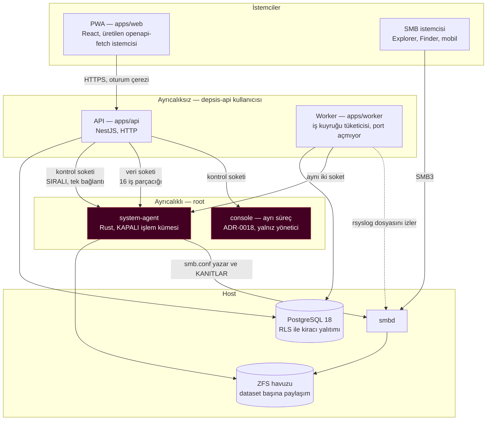
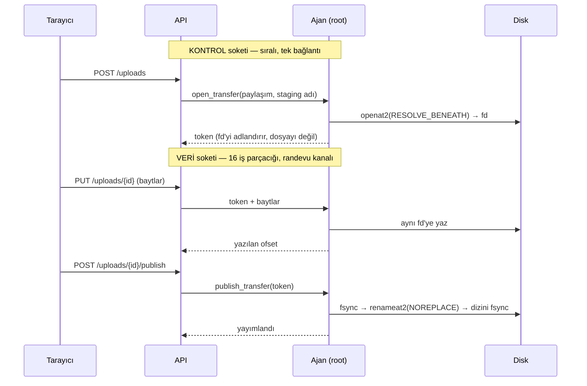
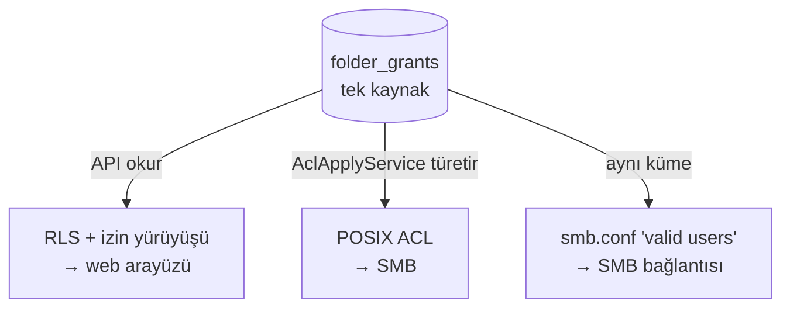
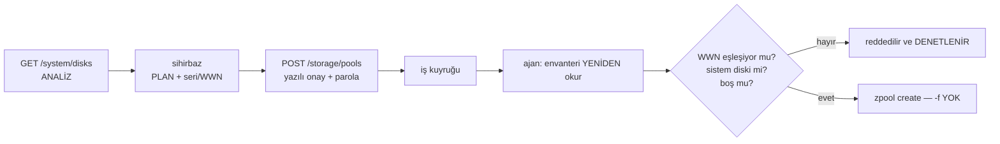

# DEPSIS mimarisi

§21'in 3. teslimatı. ADR'lerin yanında duruyor ve onların yerini almıyor: burası **ne olduğu**,
`docs/adr/` **neden öyle olduğu**. Bir çelişki olursa ADR'ler haklıdır — onlar kararın kendisi, bu
belge kararın resmi.

---

## 1. Süreçler ve aralarındaki sınır

**Kırmızı kutular güven sınırının öbür tarafı.** §2.2 ve ADR-0006: API root olamaz, ve ajan
API'nin gönderdiği hiçbir şeyi bir komut satırına serbestçe koymaz. Ajanın kabul ettiği işlem
kümesi KAPALI — bugün 28 işlem — ve her operandın tipi, o operandın yapamayacağı şeyi ifade
edilemez kılıyor: bir paylaşım adı `SafeComponent`'tir, yani içinde `/` ya da `..` olamaz; bir
grup kimliği `PosixId`'dir, yani 0 olamaz.

**Kim kimdir, çekirdek söylüyor.** Ajan `SO_PEERCRED` ile bağlanan sürecin uid'sini okuyor ve
`DEPSIS_API_UID` ile karşılaştırıyor — telden gelen hiçbir iddiaya değil. uid 0 doğrudan
reddediliyor: yoksa kutudaki her root süreci ayrıcalıklı işlem sürebilirdi, ve `authz`'deki
root-reddi hiç çalışmazdı.

**Worker'ın portu yok.** Arka plan döngüsünü HTTP sürecinin içine koymak aynı olay döngüsü ve aynı
bağlantı havuzu için yarışmak demek; CPU'yu tüketen bir iş, sebebi görünmeyen bir istek gecikmesine
dönüşür. Ayrı olmasının ikinci faydası: hiçbir şeyi dinlemediği için unit dosyası API'ninkinden
daha sıkı.

---

## 2. İki soket, ve neden iki

Kontrol soketi **bilerek sıralı** (ADR-0006): ayrıcalıklı işlemler sıraya girer ve hiçbiri
diğeriyle yarışmaz. Ama 10 GB'lık bir yükleme o soketi tutsaydı, süresi boyunca kutudaki her
ayrıcalıklı çağrıyı bloklardı — bu yüzden baytlar ADR-0017'nin ayrı veri soketinden geçiyor.

**Token bir descriptor'ı adlandırıyor, bir dosyayı değil.** Yol ÇÖZÜMLEMESİ bir kez, kontrol
soketinde oluyor; veri soketinden gelen hiçbir şey hangi dosyaya yazıldığını değiştiremez. Bir
yüklemeyi iki bağlantıya bölmeyi güvenli yapan şey bu.

---

## 3. Bir dosyanın iki gerçekliği

DEPSIS'te bir klasör hem bir veritabanı satırı HEM bir dizin. İkisinin ayrışması bu ürünün en
pahalı hata sınıfı, ve mimarinin büyük kısmı onu engellemek için var.

```mermaid
flowchart LR
    subgraph write["Web'den yazma"]
        w1["file_entries satırı"] --> w2["ajan: create_directory"]
    end
    subgraph smbw["SMB'den yazma"]
        s1["smbd dosyayı yazar"] --> s2["full_audit satırı"]
        s2 --> s3["worker: index_queue"]
        s3 --> s4["files.index-drain işi"]
        s4 --> w1
    end
    subgraph walk["Ağ"]
        p1["files.reconcile — 15 dk"] --> w1
    end

    style smbw fill:#022,stroke:#4aa
    style walk fill:#221,stroke:#aa4
```

SMB API'den **hiç geçmiyor**, o yüzden oradan yazılan bir dosyanın satırı kendiliğinden oluşmuyor.
İki katman var ve ikisi de gerekli (ADR-0011):

- **Hızlı yol** — Samba'nın `full_audit`'i, saniyeler. Yalnız bu olsaydı ürün SESSİZCE YANLIŞ
  olurdu: kaçırılan bir denetim satırı kalıcı olarak eksik bir indeks demek.
- **Yürüyüş** — on beş dakikada bir, diski veritabanıyla karşılaştırır. Yalnız bu olsaydı ürün GEÇ
  olurdu, ve §5.3 bir SLA istiyor.

---

## 4. Erişim: iki uygulayıcı, tek kaynak

Web arayüzünü veritabanı, SMB'yi dosya sistemi yönetiyor, ve **ikisi aynı tablodan türetiliyor**.
Birini güncelleyip diğerini güncellememek, "izni kaldırdım" ile "erişim gerçekten kapandı"
arasındaki farktır — ve SMB API'den geçmediği için orada yalnız çekirdeğin uyguladığı şey geçerli
(ADR-0004).

`valid users` yalnız DARALTABİLİR, o yüzden ACL'in izin verdiğinin üst kümesi olması güvenli yön.

---

## 5. Yıkıcı işlemin yolu

Ürünün disk silen tek yolu, ve §8.1'in sırası mimaride görünür durumda:

Adımlar API katmanında; **doğrulamalar ajanda**. Sebep: API'de yapılan bir kontrol API'ye VERİLMİŞ
bir listeye karşı yapılır — istemcinin kendi ekranını doğru kopyaladığını kanıtlar, diskin ne
olduğunu değil. Ajan envanteri kendisi ve tam o anda okuyor, çünkü sihirbazla düğme arasında bir
disk değişebilir ve `/dev/disk/by-id` bir yuvayı değil bir AYGITI adlandırır.

---

## 6. Kod nerede

| Yol                       | Ne                                                                        |
| ------------------------- | ------------------------------------------------------------------------- |
| `apps/web`                | PWA. İstemci ÜRETİLİYOR (ADR-0001), elle yazılmıyor.                      |
| `apps/api`                | NestJS. Kiracı bağlamı, izinler, sözleşmenin sunulan yarısı.              |
| `apps/worker`             | Kuyruk tüketicisi ve SMB denetim akışının okuyucusu.                      |
| `services/system-agent`   | Rust. Kapalı işlem kümesi; çekirdek `cfg` içermez, seam'ler `unix.rs`'te. |
| `packages/contracts`      | OpenAPI — tek kaynak. `apps/web`'in istemcisi buradan üretilir.           |
| `packages/agent-protocol` | Ajanın şeması; Rust `--emit-schema` ile ÜRETİR, TypeScript tüketir.       |
| `packages/db`             | Göçler. Her biri geri alınabilir (`tools/ci/migration-check.sh`).         |
| `packages/authz`          | İzin çözümü; API ve worker aynı kodu kullanır.                            |
| `e2e`                     | Playwright. Yığın DIŞARIDAN gelir — `tools/dev/e2e-stack.sh`.             |
