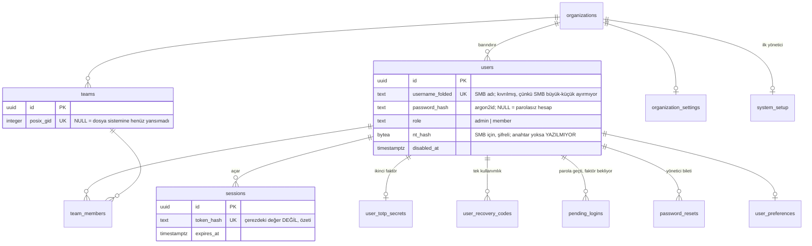
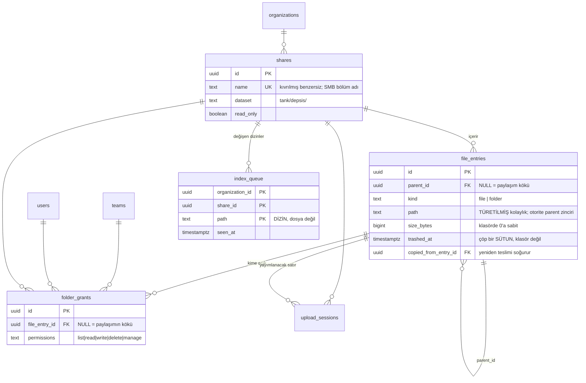
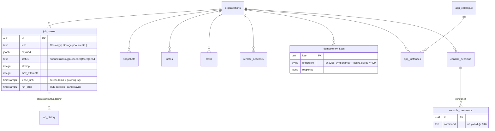

# DEPSIS veri modeli — ER diyagramı

§21'in 5. teslimatı. Şema `packages/db/migrations/` içindeki 25 göçten çıkıyor; bu belge onların
**okunabilir** hâli, kaynağı değil. İkisi ayrışırsa göçler haklıdır.

Diyagramın taşımadığı iki şey var ve ikisi de bu şemanın en önemli özellikleri, o yüzden altta
yazıyla duruyorlar: **kiracı yalıtımı** ve **kimin neye erişebildiği**.

---

## 1. Kiracılık: neredeyse her ok aynı yere gidiyor

Yirmi dokuz tablonun yirmi beşi `organizations`'a bağlı, ve bu bir tasarım tercihi değil
ADR-0015'in kendisi: her satır bir kiracıya ait, ve hangi kiracıya ait olduğu satırın kendisinde
yazıyor. Bunu diyagrama tek tek çizmek elli dört okun yirmi beşini "her şey buraya" demek için
harcamak olurdu, o yüzden aşağıdaki diyagramlarda `organization_id` **çizilmiyor** — istisnaları
saymak daha kısa:

| Tablo            | Neden kiracısız                                                                                                   |
| ---------------- | ----------------------------------------------------------------------------------------------------------------- |
| `organizations`  | Kiracının kendisi.                                                                                                |
| `system_setup`   | İlk kiracıyı var eden satır, yani zorunlu olarak ondan önce gelir (ADR-0015 §5d).                                 |
| `login_attempts` | Var olmayan bir kısa ada yapılan deneme hiçbir kiracıya atfedilemez, ve kısıtlama tam o noktada çalışmak zorunda. |
| `app_catalogue`  | Cihaz genelinde bir katalog; kurulum (`app_instances`) kiracıya ait.                                              |
| `job_history`    | Biten işler; `job_queue`'nun aksine sorgulanmıyor, arşivleniyor.                                                  |

---

## 2. Kimlik ve erişim

**`username_folded` neden ayrı bir sütun.** SMB istemcileri `Ayse` ile `ayse`'yi aynı ad sayıyor,
PostgreSQL saymıyor. Benzersizlik kıvrılmış hâl üzerinde; gösterilen ad ayrı duruyor.

**`posix_gid` neden NULL olabiliyor.** Bir ekip önce veritabanında var oluyor, sonra ayrıcalıklı
ajan ona bir grup açıyor. Aradaki durum gerçek ve arayüzde "dosya sistemine yansımadı" diye
görünüyor — sahte bir gid yazmak, hiçbir şeyin uygulamadığı bir izin demek olurdu.

---

## 3. Dosyalar ve izinler

**`path` otorite değil.** Yeniden adlandırma alt ağacın `path`'ini güncelliyor, ama "bu klasör
nerede" sorusunun cevabı `parent_id` zinciri. İkisi ayrışırsa — yayılmamış bir yeniden adlandırma
— yürüyüş zinciri izliyor, çünkü ürünün geri kalanı onu kullanıyor.

**`trashed_at` bir sütun, çöp bir klasör değil.** Baytlar yerinde duruyor. İndeksleme yürüyüşünün
çöpteki satırları "adını hesaba katıp başka hiçbir işlem yapmadan" geçmesinin sebebi bu: onları
hariç tutmak, kullanıcının zaten sildiği şey için her on beş dakikada bir İKİNCİ satır yazardı.

**`index_queue`'nun birincil anahtarı yolu içeriyor.** Bir klasöre on bin dosya kopyalanması on bin
satır değil, `seen_at`'i ilerleyen tek satır: kuyruk olay sayısıyla değil DEĞİŞEN DİZİN sayısıyla
büyüyor.

---

## 4. İşler, aktarımlar ve sistem

**`run_after` tek dayanıklı zamanlayıcı.** TypeScript tarafında `setInterval` yok: yalnız o süreç
ayaktayken çalışan ve yeniden başlatmada kaybolan bir zamanlayıcı, bir saklama politikasının
sessizce durması demek. Her çalışma bir sonrakini kuyruğa alıyor.

**`lease_until` çökme tespitinin kendisi.** Ayrı bir kalp atışı tablosu yok. Ve `claim_job` kirası
dolmuş `running` bir işi `max_attempts`'e BAKMADAN geri alıyor — sayaç yalnız `finish_job`'da,
`failed` ile `dead` arasında seçim için okunuyor. Yani `max_attempts: 1`, bildirilmiş bir hatadan
sonraki yeniden denemeyi engelliyor; çökmüş bir işçinin işinin geri alınmasını değil.

---

## 5. Diyagramın gösteremediği: satır düzeyi güvenlik

Yukarıdaki okların hiçbiri erişim kontrolü değil. Kiracı yalıtımını **RLS** yapıyor:

- Her kiracılı tabloda `FORCE ROW LEVEL SECURITY`, yani tablonun sahibi bile atlayamıyor.
- Politika `current_setting('depsis.organization_id')` ile karşılaştırıyor, ve o değer her
  işlemin başında `SET LOCAL` ile konuyor — bind parametresiyle değil, çünkü `SET LOCAL` bir bind
  parametresi kabul etmiyor ve bunu sanmak sessizce yanlış kiracıyı seçmenin yoludur.
- Bağlantı havuza dönerken bağlam kayboluyor; bu, tümleşik testlerde ölçülüyor.

Klasör erişimini ise `folder_grants` **ve** dosya sistemindeki POSIX ACL'ler birlikte belirliyor.
Veritabanı web arayüzünü, ACL'ler SMB'yi yönetiyor, ve ikisi aynı tablodan türetiliyor — çünkü SMB
API'den hiç geçmiyor ve yalnız mod bitlerini uyguluyor. Bir tanesini güncelleyip diğerini
güncellememek, "izni kaldırdım" ile "erişim gerçekten kapandı" arasındaki farktır (ADR-0004).
