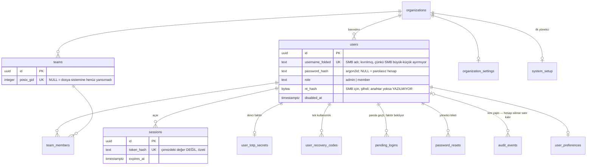
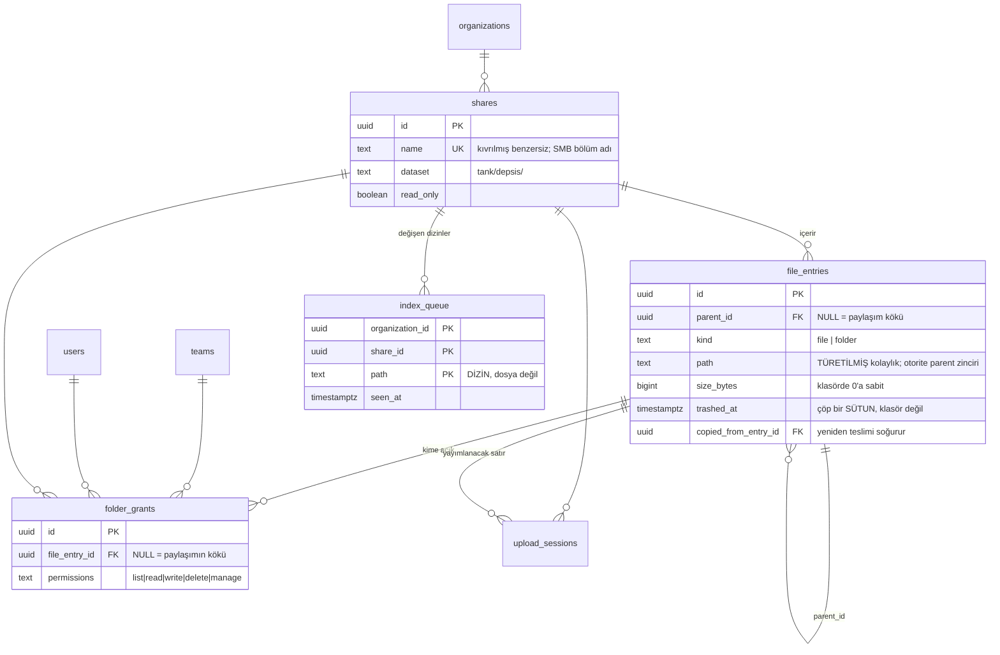
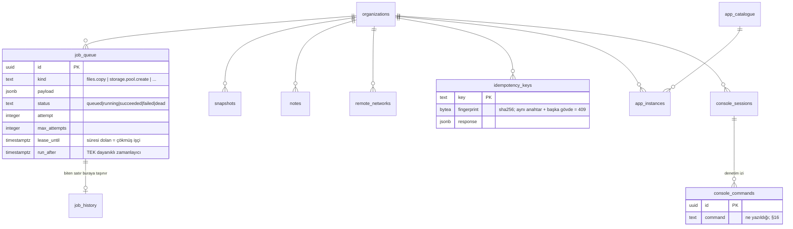
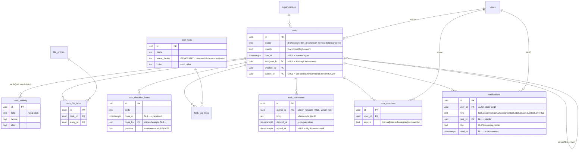

# DEPSIS veri modeli — ER diyagramı

§21'in 5. teslimatı. Şema `packages/db/migrations/` içindeki göçlerden çıkıyor (bugün 36); bu belge onların
**okunabilir** hâli, kaynağı değil. İkisi ayrışırsa göçler haklıdır.

Diyagramın taşımadığı iki şey var ve ikisi de bu şemanın en önemli özellikleri, o yüzden altta
yazıyla duruyorlar: **kiracı yalıtımı** ve **kimin neye erişebildiği**.

---

## 1. Kiracılık: neredeyse her ok aynı yere gidiyor

Yirmi dokuz tablonun yirmi beşi `organizations`'a bağlı, ve bu bir tasarım tercihi değil
ADR-0015'in kendisi: her satır bir kiracıya ait, ve hangi kiracıya ait olduğu satırın kendisinde
yazıyor. Bunu diyagrama tek tek çizmek elli dört okun yirmi beşini "her şey buraya" demek için
harcamak olurdu, o yüzden aşağıdaki diyagramlarda `organization_id` **çizilmiyor** — istisnaları
saymak daha kısa:

| Tablo            | Neden kiracısız                                                                                                   |
| ---------------- | ----------------------------------------------------------------------------------------------------------------- |
| `organizations`  | Kiracının kendisi.                                                                                                |
| `system_setup`   | İlk kiracıyı var eden satır, yani zorunlu olarak ondan önce gelir (ADR-0015 §5d).                                 |
| `login_attempts` | Var olmayan bir kısa ada yapılan deneme hiçbir kiracıya atfedilemez, ve kısıtlama tam o noktada çalışmak zorunda. |
| `app_catalogue`  | Cihaz genelinde bir katalog; kurulum (`app_instances`) kiracıya ait.                                              |
| `job_history`    | Biten işler; `job_queue`'nun aksine sorgulanmıyor, arşivleniyor.                                                  |

---

## 2. Kimlik ve erişim

**`username_folded` neden ayrı bir sütun.** SMB istemcileri `Ayse` ile `ayse`'yi aynı ad sayıyor,
PostgreSQL saymıyor. Benzersizlik kıvrılmış hâl üzerinde; gösterilen ad ayrı duruyor.

**`posix_gid` neden NULL olabiliyor.** Bir ekip önce veritabanında var oluyor, sonra ayrıcalıklı
ajan ona bir grup açıyor. Aradaki durum gerçek ve arayüzde "dosya sistemine yansımadı" diye
görünüyor — sahte bir gid yazmak, hiçbir şeyin uygulamadığı bir izin demek olurdu.

---

## 3. Dosyalar ve izinler

**`path` otorite değil.** Yeniden adlandırma alt ağacın `path`'ini güncelliyor, ama "bu klasör
nerede" sorusunun cevabı `parent_id` zinciri. İkisi ayrışırsa — yayılmamış bir yeniden adlandırma
— yürüyüş zinciri izliyor, çünkü ürünün geri kalanı onu kullanıyor.

**`trashed_at` bir sütun, çöp bir klasör değil.** Baytlar yerinde duruyor. İndeksleme yürüyüşünün
çöpteki satırları "adını hesaba katıp başka hiçbir işlem yapmadan" geçmesinin sebebi bu: onları
hariç tutmak, kullanıcının zaten sildiği şey için her on beş dakikada bir İKİNCİ satır yazardı.

**`index_queue`'nun birincil anahtarı yolu içeriyor.** Bir klasöre on bin dosya kopyalanması on bin
satır değil, `seen_at`'i ilerleyen tek satır: kuyruk olay sayısıyla değil DEĞİŞEN DİZİN sayısıyla
büyüyor.

---

## 4. İşler, aktarımlar ve sistem

**`run_after` tek dayanıklı zamanlayıcı.** TypeScript tarafında `setInterval` yok: yalnız o süreç
ayaktayken çalışan ve yeniden başlatmada kaybolan bir zamanlayıcı, bir saklama politikasının
sessizce durması demek. Her çalışma bir sonrakini kuyruğa alıyor.

**`lease_until` çökme tespitinin kendisi.** Ayrı bir kalp atışı tablosu yok. Ve `claim_job` kirası
dolmuş `running` bir işi `max_attempts`'e BAKMADAN geri alıyor — sayaç yalnız `finish_job`'da,
`failed` ile `dead` arasında seçim için okunuyor. Yani `max_attempts: 1`, bildirilmiş bir hatadan
sonraki yeniden denemeyi engelliyor; çökmüş bir işçinin işinin geri alınmasını değil.

---

## 5. Masa: işler ve bildirimler

**Etiket KİRACININ SÖZLÜĞÜ, işin bir alanı değil.** `tasks` üzerinde bir metin dizisi daha az
tablo olurdu ve bir sözlüğün çözdüğü şeyi çözmezdi: "acil", "Acil" ve "acıl" üç ayrı etiket olur ve
kimse hangisini yazdığını hatırlamaz. Benzersizlik `name_folded` üzerinden — `fold_identity`, yani
kullanıcı adlarındaki aynı fonksiyon: büyük/küçük harf ve Türkçe i ailesi katlanıyor, **aksanlar
katlanmıyor** ("Çağrı" ile "Cagri" ayrı, çünkü arama için doğru olan kimlik için yanlış).

**Renk sabit bir paletten**, serbest bir hex alanı değil: karanlık zemine karşı görünmeyen bir
etiket, olmayan bir etiket.

**Herkes etiket oluşturup takabiliyor, yalnız yönetici yeniden adlandırıp silebiliyor.** İkisi de
kiracı çapında — bir adı değiştirmek onu kullanan her işin anlamını değiştiriyor, silmek her işten
kaldırıyor. Oluşturmayı da yöneticiye kilitlemek ise etiketlemeyi bir talep sürecine çevirir ve
kimse kullanmaz.

**Alt görev bir SÜTUN, yeni bir tablo değil.** Bir alt görev tam olarak bir görev: atanabiliyor,
kendi durumu, önceliği, son tarihi, yorumu ve izleyicisi oluyor. Ayrı bir tablo bunların hepsinin
ikinci bir kopyasını gerektirirdi, ve o kopyalar zamanla ayrışırdı.

**TEK SEVİYE, ve onu `tasks_one_level_deep` TETİKLEYİCİSİ tutuyor.** Kural bir CHECK ile ifade
edilemiyor çünkü başka bir satıra bakması gerekiyor; yalnız serviste tutulsaydı, ikinci bir yazma
yolu açıldığı gün sessizce kaybolurdu. Üç şeyi birden reddediyor: bir alt görevin kendi alt görevi,
bir işin kendine ebeveynliği, ve parçaları olan bir işin başka bir şeyin parçası olması. Keyfi
derinlikte bir ağaç, bir yapılacaklar panosunu bir dosya yöneticisine çevirir.

**Kontrol listesi maddesi bir alt görev DEĞİL, ve ikisi birden var.** Bir madde atanamıyor, son
tarihi yok, bildirim üretmiyor. Bunlardan herhangi birini isteyen şey zaten bir alt görev; biri
eksik olsaydı insanlar ötekini onun yerine kullanırdı, ve ikisi de kötü olurdu — her adım için ayrı
bir iş açmak panoyu okunmaz yapıyor, tek bir gövdeye madde madde yazmak hiçbirini takip edilebilir
yapmıyor.

**`task_watchers` bir TAHMİNİN yerini aldı.** Bildirim bir zamanlar "atanan + oluşturan" diyordu,
ve o çoğu zaman doğru cevaptı — ama yalnızca çoğu zaman, ve yanlış olduğunda hiçbir belirti
vermiyordu. İş oluşturmak, atanmak ve yorum yazmak otomatik abone ediyor, yani eski davranış hâlâ
varsayılan; artık ilgilenen üçüncü bir kişinin de bir yolu var. **Anılmak abone ETMİYOR:** bir kez
anılmanın kişiyi işin bütün gelecek gürültüsüne kaydetmesi, insanların bildirimleri okumayı bırakma
sebebi.

**Yorumlar YUMUŞAK siliniyor** ve `task_comments`'ta `DELETE` yetkisi yok — silme bir `UPDATE`.
Gövde tabloda kalıyor, API onu bir daha döndürmüyor, ve `task_activity`'ye bir denetim satırı
düşüyor. Uygulamanın satırı gerçekten kaldıracak bir yolu olmaması, yumuşak silmenin yumuşak
kalmasının tek garantisi.

**Mention'ın kendi tablosu YOK, ve bilerek.** Bir mention gövdenin içinde yaşıyor; onu ayrıca
saklamak, gövdeyle ayrışabilen ikinci bir doğruluk kaynağı olurdu. Kalıcı olan şey, çözümün o an
ürettiği BİLDİRİM — yani "kime gitti" sorusunun cevabı, adların bugünkü hâline değil o günküne
bağlı.

**Bildirim ALICI BAŞINA bir satır, olay başına değil.** Bir işin el değiştirmesi tek olay ama iki
farklı cümle: yeni atanan "sana bir iş atandı" okuyor, eski atanan "bu iş artık sende değil". Tek
satırla ikisinden biri yanlış cümleyi görürdü.

**`title` o an donduruluyor, `task_id` ise canlı.** Bildirim "ne olmuştu" sorusunu, işin kendisi
"şimdi ne durumda" sorusunu cevaplıyor; ikisi farklı sorular ve zamanla farklı cevaplar veriyorlar.

**Kimse kendi yaptığı şey için bildirim almıyor**, ve bu bir görgü kuralı değil bir işlevsellik
kararı: sürekli yanan bir zil okunmayan bir zile dönüşüyor.

**`notifications` üzerinde kısmi benzersiz indeks var** — `(organization_id, user_id, task_id,
kind)`, yalnız `read_at IS NULL` ve `task_id IS NOT NULL` için. Gecikme taraması on beş dakikada
bir koşuyor ve onsuz gecikmiş bir iş bir haftada bin satır üretirdi.

**RLS kiracıyı tutuyor, kişiyi SORGU tutuyor.** Politika `depsis.organization_id`'yi biliyor,
oturumdaki kullanıcıyı bilmiyor — `depsis.user_id` diye bir oturum değişkeni yok. Yani "başkasının
bildirimini okuyamazsın" cümlesini tutan tek şey her sorgudaki `user_id`, ve bu bilinçli: ikinci bir
oturum değişkeni eklemek, unutulduğunda SESSİZCE herkesin her şeyi gördüğü bir sistem üretirdi.
İkinci bir oturum değişkeni yoksa o risk kiracı sınırını geçemiyor.

---

## 6. Diyagramın gösteremediği: satır düzeyi güvenlik

Yukarıdaki okların hiçbiri erişim kontrolü değil. Kiracı yalıtımını **RLS** yapıyor:

- Her kiracılı tabloda `FORCE ROW LEVEL SECURITY`, yani tablonun sahibi bile atlayamıyor.
- Politika `current_setting('depsis.organization_id')` ile karşılaştırıyor, ve o değer her
  işlemin başında `SET LOCAL` ile konuyor — bind parametresiyle değil, çünkü `SET LOCAL` bir bind
  parametresi kabul etmiyor ve bunu sanmak sessizce yanlış kiracıyı seçmenin yoludur.
- Bağlantı havuza dönerken bağlam kayboluyor; bu, tümleşik testlerde ölçülüyor.

Klasör erişimini ise `folder_grants` **ve** dosya sistemindeki POSIX ACL'ler birlikte belirliyor.
Veritabanı web arayüzünü, ACL'ler SMB'yi yönetiyor, ve ikisi aynı tablodan türetiliyor — çünkü SMB
API'den hiç geçmiyor ve yalnız mod bitlerini uyguluyor. Bir tanesini güncelleyip diğerini
güncellememek, "izni kaldırdım" ile "erişim gerçekten kapandı" arasındaki farktır (ADR-0004).
