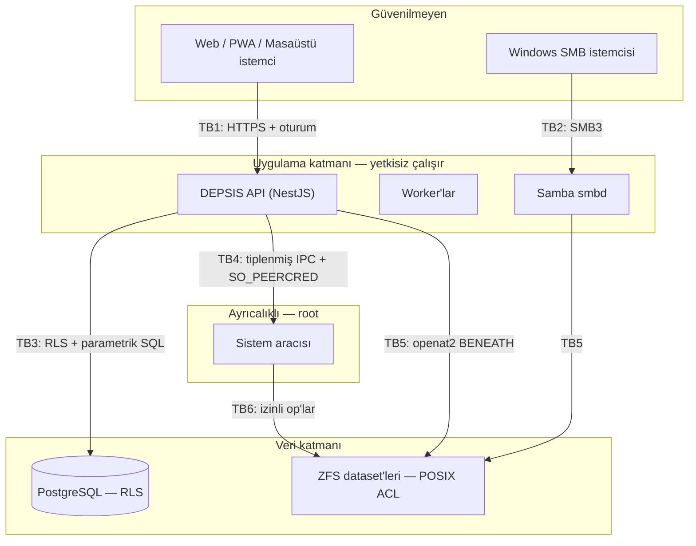

# DEPSIS Tehdit Modeli

- **Sürüm:** Faz 1 (2026-08-25). Faz 0 tabanı 2026-08-14.
- **Kapsam:** Faz 1 sonunda çalışan sistem. Faz 0'da karara bağlanan mimari §1–§10'da; o tarihten
  sonra eklenen altı yüzey ve Faz 1'de BULUNAN açıklar §11'de.
- **İlgili:** [ADR dizini](../adr/README.md), [Faz 0 kickoff](../plan/phase-0-kickoff.md)

Bu belge jenerik bir STRIDE tablosu değildir. Faz 0 araştırması, güvenlik açısından **yedi
varsayımı çürüttü**; bunların üçü doğrudan sessiz yetki açığıydı. Model, o bulgular üzerine
kurulmuştur.

---

## 1. Korunan varlıklar

| Varlık                                                          | Neden değerli                   | Kaybı ne demek                            |
| --------------------------------------------------------------- | ------------------------------- | ----------------------------------------- |
| Kullanıcı dosyaları                                             | Ürünün varlık sebebi            | Geri dönüşü olmayan iş/kişisel veri kaybı |
| Dosya **erişim kontrolü**                                       | Çok kullanıcılı sistemin temeli | Bir kullanıcı diğerinin dosyalarını görür |
| Kimlik bilgileri (parola hash'i, TOTP secret, kurtarma kodları) | Hesap ele geçirme               | Tüm hesaba erişim                         |
| Sistem secret'ları (DB parolası, ZeroTier controller secret)    | Altyapı ele geçirme             | Ağ ve sistem düzeyinde tam erişim         |
| Denetim günlüğü                                                 | Olay sonrası tespit             | Saldırı izinin silinmesi                  |
| ZFS havuzu bütünlüğü                                            | Tüm verinin fiziksel taşıyıcısı | Toplam kayıp                              |
| Yedek ve şifreleme anahtarları                                  | Son savunma hattı               | Kurtarma imkânsız                         |

## 2. Saldırgan profilleri

| Profil                              | Yetenek                          | Bu modelde nasıl ele alınıyor                                                          |
| ----------------------------------- | -------------------------------- | -------------------------------------------------------------------------------------- |
| **Kötü niyetli standart kullanıcı** | Geçerli hesap, web + SMB erişimi | Birincil tehdit. Tüm yetki kontrolleri buna karşı tasarlandı                           |
| **Ele geçirilmiş istemci**          | Kullanıcının oturumu, cihazı     | Kısa oturum, cihaz listesi, iptal edilebilirlik                                        |
| **Yerel ağdaki saldırgan**          | Ağ trafiği, servis portları      | TLS, SMB3 imzalama, servis yüzeyi daraltma                                             |
| **Zararlı yükleme**                 | Dosya içeriği kontrolü           | Karantina, sandbox'lı önizleme, dekompresyon limitleri                                 |
| **Tedarik zinciri**                 | Bağımlılık veya image            | Lockfile, digest pinleme, CI taraması                                                  |
| **Yanlış yapılandırma**             | —                                | **Faz 0'ın en verimli bulgu alanı**; bkz. §5                                           |
| **Fiziksel disk kaybı**             | Diske fiziksel erişim            | Yedek şifreleme; disk şifrelemesi Faz 4                                                |
| İnternete doğrudan açık saldırgan   | —                                | **Kapsam dışı varsayım**: DEPSIS doğrudan internete açılmaz, erişim ZeroTier üzerinden |

## 3. Güven sınırları



| #       | Sınır                    | Kim geçiyor               | Uygulanan kontrol                                     |
| ------- | ------------------------ | ------------------------- | ----------------------------------------------------- |
| **TB1** | İstemci → API            | Güvenilmeyen girdi        | Oturum + CSRF + zod doğrulama + rate limit            |
| **TB2** | Windows → Samba          | Güvenilmeyen girdi        | SMB3, `security = user`, POSIX ACL                    |
| **TB3** | API → PostgreSQL         | Uygulama rolü             | **`FORCE` RLS** + rol ayrımı (ADR-0013)               |
| **TB4** | API → Sistem aracısı     | **En kritik sınır**       | Kapalı tiplenmiş op enum'u, `SO_PEERCRED`, socket DAC |
| **TB5** | Uygulama → Dosya sistemi | Kullanıcı kaynaklı yollar | `openat2(BENEATH\|NO_SYMLINKS\|NO_XDEV)`              |
| **TB6** | Aracı → İşletim sistemi  | root                      | argv-only `execve`, mutlak yol, `env_clear()`         |

## 4. Kabul edilen ayrıcalık: aracı root çalışır

Bunu gizlemek yerine yazıyoruz. `zpool` operasyonları delege edilemez; seçenek root ya da
`CAP_SYS_ADMIN`'dir ve **`CAP_SYS_ADMIN` root-eşdeğeridir**. Ambient capability'lerin burada
güvenlik satın aldığını iddia etmek kendini kandırmaktır.

> **P0-D düzeltmesi:** bu paragrafın ilk hâli `mount` işleminin de delege edilemediğini ve bu
> yüzden ADR-0011 Katman 3'ün root gerektirdiğini söylüyordu. Ölçüm bunu çürüttü — `zfs allow`
> ile yetkisiz kullanıcı `mount` izni olmadan bile snapshot alabiliyor. **Katman 3 artık root
> çalışmıyor.** Root kalan tek bileşen sistem aracısının kendisidir.

Güvenlik capability daraltmasından değil, **yüzey daraltmasından** gelir (ADR-0006):

1. Operasyon yüzeyi **kapalı bir tiplenmiş enum** — shell yok, pass-through argüman yok.
2. Her çağrıda `peer_cred` ile uid/gid yetkilendirmesi; socket dosyası DAC'ı ilk kapı.
3. Her yol `openat2` ile hapsedilir.
4. `RestrictAddressFamilies=AF_UNIX` — aracı **ağ soketi açamaz**; bu tek satır sömürü sonrası
   veri sızdırma yollarının çoğunu kapatır.

Bu, kalıntı risk olarak kaydedilmiştir. Aracının op enum'unun kapalı kalması pazarlık konusu
değildir; genişleyen her op bu riskin yüzeyini büyütür.

## 5. Faz 0'da bulunan sessiz açıklar

Bu bölüm modelin en değerli kısmıdır: bunların hiçbiri hata mesajı üretmez. Sistem çalışıyor
görünürken açık kalır.

### 5.1 `acltype=nfsv4` → ACL'lerin tamamen kapanması

`zfsprops(7)`: _"The nfsv4 ZFS ACL type is not yet supported on Linux"_. Bir `acltype=nfsv4`
dataset'i **hiç ACL uygulamaz** — her kullanıcı mod bit'lerinin izin verdiği her şeye erişir.

**P0-B'de ölçüldü ve belgenin ima ettiğinden daha kötü çıktı.** Belge desteklenmeyen bir
acltype'ın `off` gibi davranacağını söylüyor; beklenti, `zfs get` çıktısında `off` görüp durumu
fark etmekti. Gerçek:

```
zfs set acltype=nfsv4  → rc=0 (BAŞARILI)
zfs get acltype        → 'nfsv4'   ← off'a düşmüyor
setfacl                → BAŞARISIZ
```

Özellik **yapılandırılmış görünüyor.** Operatör de, bir doğrulama kontrolü de `nfsv4` okuyup
"bir ACL türü ayarlanmış" diye geçebilir. Görünür hiçbir sinyal yok.

**Kontrol:** dataset oluşturma anında `acltype` doğrulanır ve doğrulama **`nfsv4`'ü açıkça
reddeder**. "Değeri boş değilse tamam" veya "`off` değilse tamam" mantığı bu tuzağa düşer —
kabul edilecek küme yalnız {`posixacl`, `posix`}. CI'da `acltype=nfsv4` geçen bir yapılandırma
reddedilir. → [P0-B, geçti](../adr/evidence/p0-b.tsv)

### 5.2 RLS'in tablo sahibi tarafından atlanması

_"Table owners normally bypass row security as well."_ Tek bir rol hem migration koşup hem trafik
sunarsa — varsayılan olarak olan budur — yazılan **her politika ölüdür**.

**Kontrol:** `depsis_owner` / `depsis_app` / `depsis_backup` rol ayrımı **ve** her kiracı
tablosunda `FORCE ROW LEVEL SECURITY`. Migration testi, RLS'i açık ama `FORCE` olmayan tablo
bulursa başarısız olur. → P0-C

### 5.3 Kısıt covert channel'ı

_"Referential integrity checks … always bypass row security"_ — belgede açık "covert channel"
uyarısıyla. `file_entries` üzerinde global bir `UNIQUE(name)`, kiracı A'ya kiracı B'nin o dosyaya
sahip olduğunu **söyler**. §18.2'nin "A, B'nin dosya adını göremez" kriterinin doğrudan ihlali.

**Kontrol:** her UNIQUE/EXCLUDE kısıtı `organization_id` içerir; içermeyeni migration testi
reddeder. → P0-C

### 5.4 Inode yeniden kullanımı ile sessiz yetki devri

Reconciliation yalnız `(dataset_id, inode)` ile eşleştirirse, silinmiş bir dosyanın ACL'i ve
sahipliği aynı inode numarasını alan **yeni ve alakasız** bir dosyaya uygulanır.

**Kontrol:** eşleştirme anahtarı `(dataset_id, inode, ino_generation)`. → P0-D

### 5.5 Arama sonuç sayacı

Filtrelenmiş bir liste dönerken toplam sayının filtrelenmemiş hesaplanması, kiracı B'nin dosya
varlığını sızdırır. Sonuç listesi kadar **sayaçlar, öneriler ve hata metinleri** de ACL
kapsamından üretilmelidir. → P0-C / P0-H

### 5.6 `.depsis` karantina ağacı

ADR-0008 her dataset'in içine `.depsis/staging` ve `.depsis/quarantine` koyuyor. Samba `veto` ve
sunucu tarafı filtreleme olmazsa kullanıcılar birbirinin yarım yüklemelerini veya **karantinaya
alınmış zararlı içeriği** görebilir. `veto files` gerçekten engellemeli, yalnız gizlememeli.
Karantina dizini **asla** paylaşılabilir olmamalıdır. → P0-B

## 6. STRIDE — sınır bazında

| Sınır                  | Spoofing                     | Tampering                                    | Repudiation                           | Info disclosure                            | DoS                             | Elevation                              |
| ---------------------- | ---------------------------- | -------------------------------------------- | ------------------------------------- | ------------------------------------------ | ------------------------------- | -------------------------------------- |
| **TB1** İstemci→API    | Argon2id + TOTP; kısa oturum | CSRF, `Idempotency-Key`, ETag/If-Match       | Append-only audit + correlation ID    | 403/404 politikası; hata metni sızdırmaz   | Rate limit (kullanıcı+IP+eylem) | RBAC/ACL; yol asla yetki girdisi değil |
| **TB2** Windows→Samba  | `security = user`, tdbsam    | SMB3 imzalama                                | `vfs_full_audit`                      | POSIX ACL kernel'de uygulanır              | Bağlantı limitleri              | ACL; `veto files`                      |
| **TB3** API→PostgreSQL | Ayrı DB rolleri              | Parametrik SQL                               | Audit tablosu                         | **`FORCE` RLS + kısıt kapsamı (§5.2–5.3)** | Bağlantı havuzu, sorgu timeout  | Uygulama rolü tablo sahibi değil       |
| **TB4** API→Aracı      | `SO_PEERCRED` + socket DAC   | Tiplenmiş şema; şemayı **Rust sahiplenir**   | Her op'ta kimlik+sebep+correlation ID | Aracı ağ soketi açamaz                     | Tek eşzamanlı ayrıcalıklı iş    | **Kapalı op enum'u; shell yok**        |
| **TB5** →Dosya sistemi | —                            | `renameat`/`linkat` atomik                   | Olay kaydı                            | `openat2 BENEATH`                          | Kota (`refquota`)               | `NO_SYMLINKS`, `NO_XDEV`               |
| **TB6** Aracı→OS       | —                            | argv-only `execve`; `--` + baştaki `-` reddi | Audit                                 | `env_clear()`                              | —                               | Mutlak yol; PATH araması yok           |

## 7. Kalıntı riskler — bilinen ve kabul edilen

| Risk                                                             | Neden kabul edildi                                                               | Ne zaman kapanır                                                                       |
| ---------------------------------------------------------------- | -------------------------------------------------------------------------------- | -------------------------------------------------------------------------------------- |
| **MFA phishing'e dayanıklı değil** (yalnız TOTP)                 | WebAuthn RP ID çıplak IP olamaz; hostname yok (ADR-0009)                         | Alan adı + güvenilen sertifika sağlandığında, Faz 2                                    |
| **Aracı root çalışıyor**                                         | `zpool` operasyonları delege edilemez (ADR-0006)                                 | Kapanmıyor; yüzey daraltmasıyla yönetiliyor                                            |
| **`/dev/zfs` mode 666** — her yerel kullanıcı ZFS ioctl açabilir | OpenZFS'in udev kuralı; ADR-0011 Katman 3'ün yetkisiz koşabilmesi buna dayanıyor | Delegasyon tablosuyla sınırlı. 0660 + özel gruba almak Katman 3'ü root'a geri döndürür |
| **HSTS gönderilmiyor**                                           | IP tabanlı erişimde HSTS o IP'yi ileride kilitler                                | Alan adı geldiğinde                                                                    |
| **Self-signed sertifika uyarısı**                                | Güvenilen CA yok                                                                 | Alan adı geldiğinde                                                                    |
| **POSIX ACL'de deny yok**                                        | Uygulanan substrat deny'yi ifade edemez (ADR-0004)                               | Substrat değişmedikçe kapanmıyor                                                       |
| **Disk şifrelemesi yok**                                         | Faz 0–3 kapsamında değil                                                         | Faz 4                                                                                  |
| **PGDG üçüncü taraf apt deposu**                                 | PG 18 `uuidv7()` ve `LIKE` için seçildi (ADR-0013)                               | PG 18 Debian stable'a girdiğinde                                                       |
| **Prebuilt native binding indirme**                              | `@node-rs/argon2` derleme zinciri gerektirmiyor ama ikili indiriyor              | CI bağımlılık+imza taramasıyla yönetiliyor                                             |

## 8. Kapsam dışı bırakılanlar

- DEPSIS **doğrudan internete açılmaz.** Uzak erişim ZeroTier üzerindendir. Doğrudan açık
  senaryo desteklenmez ve UI bunu söyler.
- Yönetici hesabının fiziksel/sosyal ele geçirilmesi.
- Donanım kaynaklı saldırılar (firmware, DMA, kötü niyetli USB).
- Yan kanal ve zamanlama saldırıları — parola karşılaştırması dışında modellenmiyor.

## 9. Sertleştirme kontrol listesi

Her sürüm öncesi doğrulanır. Kaynağı olan maddeler ADR'ye bağlıdır.

**Kimlik ve oturum**

- [ ] Argon2id; parametreler donanıma göre kalibre edildi
- [ ] Oturum çerezi `HttpOnly` + `Secure` + `SameSite=Lax`; JWT **kullanılmıyor**
- [ ] Kurtarma kodları hash'li ve tek kullanımlık
- [ ] İlk yönetici parolası hiçbir log/config/QR'da düz metin **değil**
- [ ] Hesap kilitleme, kilitlemeyi silah hâline getirmiyor

**Yetki**

- [ ] Her dataset'te `acltype=posixacl` doğrulandı (`nfsv4` **yasak**) — §5.1
- [ ] `FORCE ROW LEVEL SECURITY` her kiracı tablosunda — §5.2
- [ ] Hiçbir UNIQUE/EXCLUDE kısıtı `organization_id` içermeden yok — §5.3
- [ ] Uygulama tablo sahibi rolüyle bağlanmıyor
- [ ] Arama sayaç/öneri/hata metni ACL kapsamından — §5.5
- [ ] Taşımada hem kaynak hem hedef yetkisi kontrol ediliyor

**Dosya sistemi**

- [ ] Tüm kullanıcı yolları `openat2(BENEATH|NO_SYMLINKS|NO_XDEV)` ile
- [ ] `.depsis` Samba'da veto **ve** API listelemesinde filtreli — §5.6
- [ ] Karantina dizini hiçbir paylaşımda görünmüyor
- [ ] Yayınlama sonrası hedef **dizin** `fsync`'i yapılıyor

**Ayrıcalık sınırı**

- [ ] Aracı serbest komut kabul etmiyor; op enum'u kapalı
- [ ] `env_clear()` + mutlak yol + `--` ve baştaki `-` reddi
- [ ] `RestrictAddressFamilies=AF_UNIX`
- [ ] `AmbientCapabilities=` **kullanılmıyor**
- [ ] Secret'lar `LoadCredential=` ile; log'larda redaction aktif

**Tedarik zinciri ve CI**

- [ ] `pnpm-lock.yaml` / `Cargo.lock` commit'li, CI `--frozen-lockfile`
- [ ] Docker image **digest** ile; `latest` yasak
- [ ] `pnpm audit`, `gitleaks`, `cargo deny` yeşil
- [ ] **Frontend bundle'da secret taraması** — controller secret hiçbir bundle'da yok

**Veri kaybı**

- [ ] Yıkıcı disk işlemi: dry-run → seri/WWN listesi → yazılı onay → yeniden kimlik doğrulama
- [ ] Yedek ayrı hedefe replike ediliyor; snapshot "yedek" olarak sunulmuyor
- [ ] Restore tatbikatı geçti

## 10. Bu modelin kanıt durumu

Bu bölümün ilk hâli "hiçbiri kanıtlanmadı, hepsi tasarım" diyordu. Beş PoC koştuktan sonra
tablo değişti — ama **bayat kötümserlik de yanlışlıktır**, o yüzden güncellendi.

| Madde                                                                | Durum                                                                  |
| -------------------------------------------------------------------- | ---------------------------------------------------------------------- |
| ACL'i çekirdek gerçekten uyguluyor; yetkisiz kullanıcı reddediliyor  | ✅ [P0-B](../adr/evidence/p0-b.tsv)                                    |
| DEPSIS'in verdiği POSIX ACL SMB descriptor'ında görünüyor            | ✅ [P0-B](../adr/evidence/p0-b.tsv)                                    |
| `.depsis` veto'su gerçekten **engelliyor**, yalnız gizlemiyor        | ✅ [P0-B](../adr/evidence/p0-b.tsv)                                    |
| İki RLS baypası (sahip + kısıt covert channel) kapatıldı             | ✅ [P0-C](../adr/evidence/p0-c.tsv)                                    |
| Reconciliation SMB rename'inden sonra kimliği koruyor                | ✅ [P0-D](../adr/evidence/p0-d.tsv)                                    |
| Kimlik `zpool export/import` sonrası kararlı                         | ✅ [P0-D](../adr/evidence/p0-d.tsv)                                    |
| Arama sayacı/sonucu kiracı sızdırmıyor                               | ✅ [P0-C](../adr/evidence/p0-c.tsv) · [P0-H](../adr/evidence/p0-h.tsv) |
| Atomik yayınlama ve kota semantiği                                   | ✅ [P0-G](../adr/evidence/p0-g.tsv)                                    |
| **Aracının serbest komutu reddettiği, `openat2` hapsinin çalıştığı** | ✅ [P0-E](../adr/evidence/p0-e.tsv)                                    |

### Hâlâ tasarım, kanıt değil

1. **TB4'ün paylaşım-içi yol yarısı.** Sınırın kendisi artık ölçülü: P0-E 82 assertion ile
   serbest komut yolunun yokluğunu, `SO_PEERCRED`'in wire'dan etkilenmediğini, soket DAC'ını ve
   `openat2` haps bayraklarını (`BENEATH`, `NO_SYMLINKS`, gerçek ZFS mount sınırında `NO_XDEV`)
   doğruladı. Kalan boşluk dar ve adı konmuş: **hiçbir operasyon henüz çağırandan paylaşım-içi
   yol almıyor**, dolayısıyla `SafePath` dispatch'e bağlı değil ve bir traversal denemesi audit'e
   düşmüyor. Faz 1'in ilk yol alan operasyonu bunu kapatmak zorunda.
2. **SMB → POSIX aşağı yönlü eşleme** (ADR-0004). Duruş A'da bloke edici değil, ama "tek köprü"
   ifadesi ölçülmedi.
3. **Güç kesintisi dayanıklılığı.** `fsync(dirfd)` çalışıyor ve sıralama uçtan uca koşuyor
   (P0-G), ama gerçek kesinti testi yapılmadı. "Sıralama çalıştı" ≠ "dayanıklı".
4. **Ölçek.** Tüm ölçümler tek bir VM'de, küçük veri kümeleriyle. §18.2'nin p95 hedefleri
   **hiçbir** koşuda test edilmedi ve edilmiş gibi sunulmamalıdır.

**Üç kapı da geçti: P0-B (yetki), P0-D (indeksleme), P0-E (ayrıcalık sınırı). Faz 1 yazılabilir.**

P0-E'nin asıl çıktısı yeşil satırlar değil, tasarımı değiştiren üç bulgu oldu: iki systemd
sertleştirme direktifi ajanın oluşturduğu mount'ları görünmez yapıyordu, serde bilinmeyen alanı
sessizce yutuyordu, ve boyut sınırı sıradan bir istemciyi reddediyordu. Üçü de **hiçbir hata
mesajı üretmeyen** türdendi — Faz 0'ın baştan beri aradığı imza.

---

## 11. Faz 1 eki

Yukarıdaki on bölüm Faz 0'da yazıldı ve "Faz 1 kodu yazıldıkça güncellenir" diyordu. Bu bölüm o
güncelleme. Ayrı tutuluyor çünkü Faz 0 bulgularının hangi kanıta dayandığı önemli ve onları
yeniden yazmak o izi bulanıklaştırırdı.

### 11.1 Faz 0'dan sonra eklenen yüzeyler

Altı tanesi var ve hiçbirinin yukarıda karşılığı yok.

| Yüzey                               | Ne getirdi                                                             | Sınır nerede                                                                                                                                                                                                    |
| ----------------------------------- | ---------------------------------------------------------------------- | --------------------------------------------------------------------------------------------------------------------------------------------------------------------------------------------------------------- |
| **Bulk veri kanalı** (ADR-0017)     | İkinci bir AF_UNIX soketi, on altı iş parçacığı, tek kullanımlık token | Token bir DESCRIPTOR'ı adlandırıyor, dosyayı değil: yol çözümlemesi kontrol soketinde bir kez oluyor ve veri soketinden gelen hiçbir şey hedefi değiştiremiyor. Token sahibi uid'e bağlı; başkası kullanamıyor. |
| **Konsol** (ADR-0018)               | Cihazda gerçek bir kabuk                                               | AYRI SÜREÇ, ajanın kapalı kümesinin dışında — §2.2 dokunulmadı. Yalnız yönetici, ve oturum varken bile parola isteniyor. Yazılan her komut `console_commands`'a düşüyor.                                        |
| **Konteyner kataloğu** (ADR-0019)   | Podman soketi, kullanıcı imajları                                      | Rootless soket; bağlama yolları İSTEKTEN gelmiyor, paylaşım kökü + paylaşım adından türetiliyor.                                                                                                                |
| **ZeroTier** (ADR-0020)             | Cihazı bir overlay ağa katma                                           | Ajan yalnız durum okuyor, katılıyor ve ayrılıyor; controller barındırmıyor.                                                                                                                                     |
| **SMB denetim akışı** (ADR-0011 K1) | Worker bir log dosyasını izliyor                                       | Dosya GÜVENİLMİYOR: bozuk satır düşüyor, tanınmayan paylaşım adı düşüyor, ve iyi biçimli bir satırın yapabileceği tek şey bir dizinin yeniden okunması — idempotent bir işlem.                                  |
| **Havuz oluşturma**                 | Disk silen tek yol                                                     | §11.2'de ayrı.                                                                                                                                                                                                  |

### 11.2 Havuz oluşturma: tehdit modelinin yeni en riskli işlemi

Risk R1'in (yanlış diski silmek) ilk kez gerçekleşebilir olduğu yer. Sıra §8.1'in: analiz → plan →
seri/WWN listesi → yazılı onay → yeniden kimlik doğrulama → iş.

**Kontrollerin nerede olduğu, tehdit modelinin asıl konusu.** Adımlar API'de; üç DOĞRULAMA ajanda,
ve bu bir tercih değil zorunluluk: API'de yapılan bir kontrol API'ye VERİLMİŞ bir listeye karşı
yapılır — istemcinin kendi ekranını doğru kopyaladığını kanıtlar, diskin ne olduğunu değil.

1. `/`, `/boot`, `/boot/efi` ya da `/efi` taşıyan disk hiçbir onayla üye olamaz.
2. Üstünde bir şey olan ve bağlı olan disk üye olamaz; ikisi `lsblk`'in FARKLI sütunlarından
   türüyor, yani birini atlatan bir aygıtın diğerlerini de atlatması gerekiyor.
3. Çıkarılabilir disk üye olamaz.
4. Her diskin WWN'i havuz kurulduğu ANDA yeniden okunan envanterle karşılaştırılıyor. Bu, ekranla
   düğme arasında disk değiştirilmesine dayanan tek kontrol: `/dev/disk/by-id` bir YUVAYI değil
   bir AYGITI adlandırıyor, yani aynı ad başka bir disk olabilir.
5. `-f` hiç geçilmiyor, yani `zpool`'un kendi reddi yerinde duruyor.

ADR-0007'nin "bu sıra API katmanındadır ve backend'e devredilmez" cümlesi bu yüzden düzeltildi.

### 11.3 Faz 1'de bulunan sessiz açıklar

Faz 0 yedi varsayım çürütmüştü. Faz 1'de bulunanlar aynı imzayı taşıyor — **hiçbir hata mesajı
üretmeyen**, kapalı görünüp bir şey uygulamayan kontroller.

| #   | Açık                                                                                                                                                                                                                                                                                                                | Nasıl bulundu                 |
| --- | ------------------------------------------------------------------------------------------------------------------------------------------------------------------------------------------------------------------------------------------------------------------------------------------------------------------- | ----------------------------- |
| 1   | **Yeniden kimlik doğrulama kısıtsız ve kayıtsızdı.** `POST /console` ve `POST /storage/pools` parolayı kendileri doğruluyordu, `LoginThrottleService`'e uğramadan. Çalınmış bir çerezle parola tam hızda denenebilir, ve `login_attempts`'te hiçbir satır kalmazdı — yöneticinin bunu öğrenmek için bakacağı tablo. | Düşman incelemesi             |
| 2   | **`holds_system` tek bir `lsblk` sütununa dayanıyordu.** Btrfs subvolume düzeninde tekil `MOUNTPOINT` kökü taşıyan diskin `/home`'unu bildiriyor, yani cihazın kendi açılış diski "sistem diski değil" görünüyordu.                                                                                                 | Düşman incelemesi             |
| 3   | **"Disk boş olmalı" yalnız tarayıcıdaki JavaScript'te uygulanıyordu.** Doğrudan bir API çağrısı, üstünde veri olan bir diski `zpool create`'e kadar taşıyabiliyordu.                                                                                                                                                | Düşman incelemesi             |
| 4   | **`execute`'un içinden dönen bir refüzasyon denetlenmiyordu.** WWN uyuşmazlığı — yani "birisi disk değiştirdi" — denetim izinde `outcome: allowed` olarak görünüyordu.                                                                                                                                              | Düşman incelemesi             |
| 5   | **Şema uyuşmazlığı hiçbir şeyi reddetmiyordu.** `available = false` kuruluyor ve `call()` ona hiç bakmıyordu; uyuşmayan çift istek alışverişine devam ediyordu.                                                                                                                                                     | Düşman incelemesi             |
| 6   | **`identity.rs` `std::os::unix`'i kütüphanede doğrudan çağırıyordu.** ADR-0006'nın "çekirdek her yerde derlenir, platforma özgü her şey seam'de" iddiası yanlıştı.                                                                                                                                                  | CI'ın Windows çapraz kontrolü |

Hepsi kapatıldı. Altısının ortak dersi: **bir kontrolün belgelenmiş olması, uygulandığı anlamına
gelmiyor** — 2, 3 ve 5'te belge doğruydu ve kod onu yapmıyordu.

### 11.4 Sertleştirme kontrol listesine eklenenler

§9'un listesine, Faz 1'de eklenen yüzeyler için:

- [ ] `/etc/depsis/api.env` hem API hem worker tarafından okunuyor; iki kopya tutulmuyor.
- [ ] `depsis-worker.service` hiçbir port dinlemiyor (`RestrictAddressFamilies` yalnız AF_UNIX +
      PostgreSQL için AF_INET).
- [ ] rsyslog denetim dosyası `0640 root:depsis-api` — worker OKUYOR, yazmıyor.
- [ ] `full_audit:success` listesi ajanın testinde tam eşleşmeyle sabit. **Samba'nın bilmediği bir
      opname bağlantıyı reddettirir ve `testparm` bunu yakalamaz.**
- [ ] Konsol yalnız yöneticiye, ve oturum varken bile parola istiyor.
- [ ] Podman soketi ROOTLESS; `DEPSIS_PODMAN_ALLOW_ROOTFUL` açık değil.
- [ ] Yeniden kimlik doğrulama `ReauthService`'ten geçiyor — kendi kopyasını yazan bir controller
      yok.

### 11.5 Hâlâ kanıt değil

§10'un listesi duruyor, ve şunlar eklendi:

- **`zpool create` gerçek disklerde koşmadı.** Komutun önündeki her şey testli; komutun kendisi
  Debian VM'de doğrulanmalı.
- **`full_audit` akışının host tarafı** (rsyslog kuralı, gerçek smbd) burada koşmadı.
- **Kısıtlama eşikleri ölçülmedi.** On hata ve bir saniye tavan gerekçelendirildi, kalibre
  edilmedi.
- **§18.2'nin p95 hedefleri hâlâ hiç ölçülmedi.**
